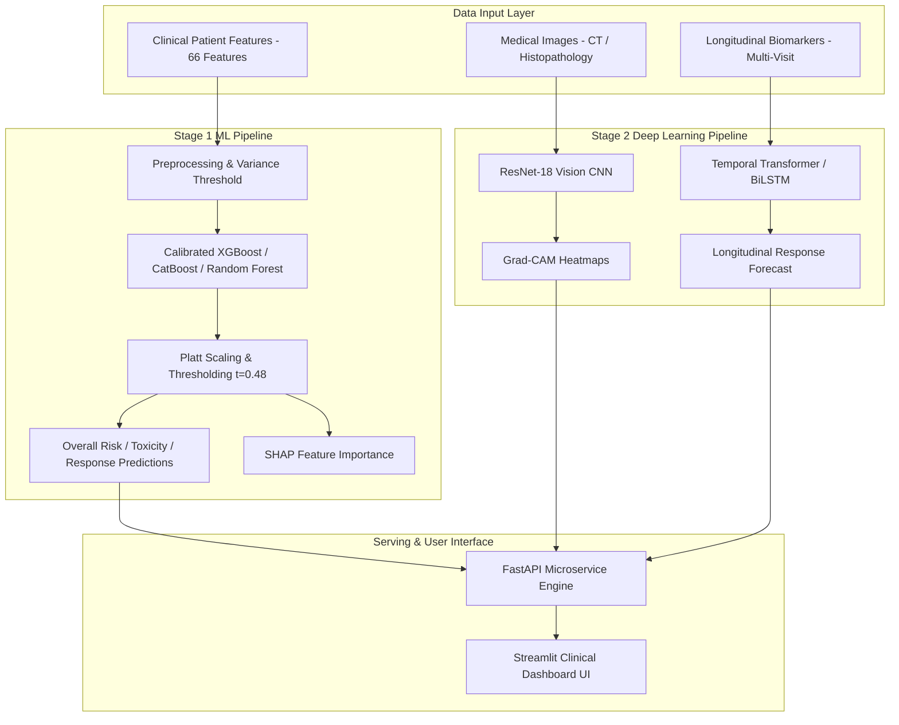

# 🩺 Personalized Precision Medicine for Oncology

[](https://www.python.org/)
[](https://pytorch.org/)
[](https://fastapi.tiangolo.com/)
[](https://streamlit.io/)
[]()

A comprehensive, end-to-end **Precision Oncology Clinical Decision Support System** integrating **Stage 1 Tabular Machine Learning** for patient risk stratification and **Stage 2 Multimodal Deep Learning** for medical imaging and longitudinal time-series biomarker forecasting.

---

## 🌟 Key System Highlights

- **Stage 1 Clinical Risk Stratification**:
  - Predicts **Overall Patient Risk** (`High`, `Moderate`, `Low`), **Toxicity Risk**, and **Therapy Response**.
  - **Calibrated XGBoost** with Platt Scaling & $t=0.48$ decision threshold prioritizing high-risk sensitivity (**78.25% High-Risk Recall**).
  - Global & local **SHAP (SHapley Additive exPlanations)** biomarker driver analysis.
- **Stage 2 Multimodal Deep Learning**:
  - **Vision Subsystem**: Fine-tuned **ResNet-18 CNN** for histopathology and CT image classification (**82.05% Accuracy, 0.8095 ROC-AUC**) with **Grad-CAM** visual saliency maps.
  - **Sequence Subsystem**: **Temporal Transformer Encoder** & **BiLSTM** for multi-visit longitudinal biomarker time-series forecasting (**84.67% Accuracy, 0.9272 ROC-AUC**).
- **Production Integration**:
  - **FastAPI REST API Service** (`/predict`, `/health`, `/leaderboard`).
  - **Streamlit Clinical Dashboard** featuring interactive patient profiling, risk scoring cards, SHAP charts, and batch CSV processing.
  - Docker containerization ready.

---

## 🏗️ System Architecture & Workflow



---

## 📊 Benchmark Performance Summary

| System Module | Model Architecture | Target Task | Accuracy | Macro F1 | ROC-AUC | Primary Highlight |
| :--- | :--- | :--- | :---: | :---: | :---: | :---: |
| **Stage 1 ML** | Calibrated XGBoost | Overall Patient Risk | **48.80%** | 0.3359 | 0.5636 | **78.25% High-Risk Recall** |
| **Stage 1 ML** | CatBoost Classifier | Toxicity Risk | **42.53%** | 0.4124 | 0.5843 | High-Risk Recall: 53.31% |
| **Stage 1 ML** | Random Forest Classifier | Therapy Response | **42.80%** | 0.3832 | 0.5566 | High-Risk Recall: 51.69% |
| **Stage 2 DL (Vision)** | ResNet-18 CNN | Image Classification | **82.05%** | 0.7310 | **0.8095** | Grad-CAM Tumor Saliency |
| **Stage 2 DL (Sequence)** | Bi-directional LSTM | Longitudinal Response | **82.00%** | 0.8164 | **0.9250** | Non-Responder F1: 84.21% |
| **Stage 2 DL (Sequence)** 🏆 | **Temporal Transformer** | Longitudinal Response | **84.67%** | **0.8442** | **0.9272** | **Responder F1: 82.44%** |

---

## 📁 Repository Directory Layout

```text
ML project/
├── config.yaml                       # Global pipeline configurations
├── data/                             # Processed datasets, model checkpoints & JSON metrics
│   └── stage1_ml/
│       ├── features/                 # Cleaned 66-feature preprocessed dataset
│       ├── models/                   # Serialized .joblib champion models & encoders
│       └── tuning/                   # CalibratedClassifierCV model artifacts
├── stage1_ml/                        # Stage 1 Tabular ML Pipeline
│   ├── data/                         # Data cleaning scripts
│   ├── eda/                          # Exploratory Data Analysis
│   ├── features/                     # Feature engineering (66 features)
│   ├── training/                     # Model training & hyperparameter tuning
│   ├── explainability/               # SHAP feature importance & driver analysis
│   ├── prediction/                   # End-to-end OncologyPredictionPipeline
│   └── evaluation/                   # Verification test suites & validation scripts
├── stage2_dl/                        # Stage 2 Deep Learning Pipeline
│   ├── vision/                       # ResNet-18 CNN, Data Augmentation & Grad-CAM
│   ├── sequence/                     # BiLSTM & Temporal Transformer models
│   └── artifacts/                    # PyTorch model weights (.pth), metrics & figures
├── integration/                      # Serving & Web Application Layer
│   ├── api/                          # FastAPI REST Microservice (main.py)
│   ├── dashboard/                    # Interactive Streamlit Clinical Dashboard (app.py)
│   └── Dockerfile                    # Containerization manifest
├── docs/                             # Complete technical & evaluation reports
│   ├── STAGE1_FINAL_VERIFICATION_REPORT.md
│   ├── STAGE1_MODEL_EFFECTIVENESS_REPORT.md
│   ├── CHAMPION_MODEL_REPORT.md
│   └── stage2_dl/                    # Stage 2 vision & sequence model reports
└── tests/                            # Automated unit & integration tests
```

---

## ⚡ Quick Start & Setup Guide

### 1. Installation & Environment Setup
Clone the repository and install dependencies:
```bash
git clone https://github.com/santhosh-25171/Oncology-treatment.git
cd Oncology-treatment
pip install -r requirements.txt
```

### 2. Run the Streamlit Clinical Dashboard
Launch the interactive dashboard UI:
```bash
streamlit run integration/dashboard/app.py
```

### 3. Launch the FastAPI REST Service
Start the backend prediction API on port 8000:
```bash
uvicorn integration.api.main:app --reload --port 8000
```
Access interactive API documentation at `http://localhost:8000/docs`.

### 4. Execute Automated Verification Tests
Run the automated test suite to verify pipeline integrity:
```bash
python stage1_ml/evaluation/final_validation.py
python stage1_ml/evaluation/test_risk_decision.py
python stage1_ml/evaluation/model_validation.py
```

---

## 📖 Key Documentation Reports

- 📄 [Stage 1 Final Verification Report](file:///docs/STAGE1_FINAL_VERIFICATION_REPORT.md)
- 📄 [Stage 1 Model Effectiveness Report](file:///docs/STAGE1_MODEL_EFFECTIVENESS_REPORT.md)
- 📄 [Stage 2 Sequence Model Comparison Report](file:///docs/stage2_dl/stage2_sequence_model_comparison.md)
- 📄 [Stage 2 Transformer Report](file:///docs/stage2_dl/stage2_transformer_report.md)
- 📄 [Stage 2 CNN Vision Report](file:///docs/stage2_dl/stage2_cnn_report.md)

---

## ⚖️ Citation & Research Disclaimer
This repository is a **research prototype** for clinical decision support in precision oncology. Model predictions and threshold tunings ($t = 0.48$) prioritize high-risk sensitivity for academic investigation and must be validated by licensed oncologists prior to any clinical deployment.
