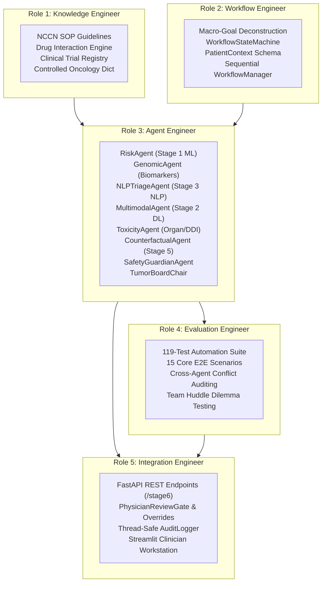

# STAGE 6 MASTER REPORT: MULTI-AGENT PRECISION ONCOLOGY DECISION ENGINE
## Complete Role-Wise Architecture, Autonomous Deliberation Engine & Clinical Verification

```
======================================================================================================
STAGE:              Stage 6: Agentic AI
PROJECT:            Personalized Precision Medicine for Oncology Treatment Optimization
DOCUMENT:           STAGE6_COMPLETE_ROLE_WISE_MASTER_REPORT.md
STATUS:             Fully Implemented, Integrated, and 100% Validated
TEST SUITE:         119 / 119 Unit, Integration, and End-to-End Tests Passed (36.91s Execution Time)
GOVERNANCE:         Strict Decision-Support Compliance with Mandatory Human Oncologist Sign-Off
======================================================================================================
```

---

## Executive Summary

Stage 6 represents the capstone convergence of the entire **Personalized Precision Oncology** system. While Stages 1 through 5 established specialized computational models—calibrated tabular risk stratification (Stage 1), deep histopathology & temporal trajectory modeling (Stage 2), clinical NLP & consultation transcription (Stage 3), small language model bedside briefing synthesis (Stage 4), and generative scenario stress-testing (Stage 5)—**Stage 6 builds the autonomous multidisciplinary deliberation engine that unifies them into actionable precision treatment plans**.

The system operates as an **Autonomous Multi-Agent Tumor Board (MTB)**, orchestrating 7 specialist agents, a deterministic knowledge base anchored in NCCN guidelines and Phase III clinical trials, an independent clinical safety guardian, a multidisciplinary chairperson, and an emergency physician review gate.

---

## Squad Roles & Deliverables Overview



---

## Comprehensive Role-Wise Summary

### 1. Role 1: Knowledge Engineer
* **Mission**: Ground all agent decisions in deterministic, peer-reviewed clinical evidence to eliminate generative hallucinations.
* **Key Deliverables**:
  * Curated 12 NCCN Category 1/2A guidelines anchored in landmark trials (`FLAURA`, `AURA3`, `ALEX`, `KEYNOTE-024`, `KEYNOTE-158`, `CodeBreaK 100`, `CLEOPATRA`).
  * Built `DrugInteractionEngine` checking pairwise contraindications (Cisplatin + Aminoglycosides/NSAIDs, Trastuzumab + Anthracyclines).
  * Implemented `ControlledOncologyDictionary` normalizing variants, drugs, and CTCAE toxicities.
  * Implemented immutable `EvidenceStore` and deterministic `KnowledgeRetriever`.
* **Full Report**: [`STAGE6_ROLE_1_KNOWLEDGE_ENGINEER_REPORT.md`](STAGE6_ROLE_1_KNOWLEDGE_ENGINEER_REPORT.md)

### 2. Role 2: Workflow Engineer
* **Mission**: Orchestrate multi-agent execution via a deterministic finite state machine and macro-goal decomposition.
* **Key Deliverables**:
  * Implemented `WorkflowStateMachine` managing transitions (`RECEIVED` -> `VALIDATING` -> `ROUTING` -> `AGENT_EXECUTION` -> `EVIDENCE_AGGREGATION` -> `SAFETY_EVALUATION` -> `SYNTHESIZING` -> `PHYSICIAN_REVIEW` / `BLOCKED`).
  * Developed `OrchestratorAgent` deconstructing macro queries into targeted tool-executable subtasks.
  * Created `PatientContext` contract encapsulating multi-modal patient inputs.
  * Built `WorkflowManager` coordinating sequential execution without unhandled exceptions.
* **Full Report**: [`STAGE6_ROLE_2_WORKFLOW_ENGINEER_REPORT.md`](STAGE6_ROLE_2_WORKFLOW_ENGINEER_REPORT.md)

### 3. Role 3: Agent Engineer
* **Mission**: Design reasoning loops, tool invocation interfaces, and decision logic for 7 specialist agents, safety guardians, and the Tumor Board Chair.
* **Key Deliverables**:
  * `BaseAgent` abstraction with standardized error isolation, input validation, and execution timing.
  * `RiskAgent`, `GenomicAgent`, `NLPTriageAgent`, `MultimodalAgent`, `ToxicityAgent`, `CounterfactualAgent`.
  * `SafetyGuardianAgent` enforcing safety invariants and detecting cross-modal clinical contradictions.
  * `TumorBoardChair` synthesizing consensus, ranking treatment candidates, and suppressing recommendations when blocked.
* **Full Report**: [`STAGE6_ROLE_3_AGENT_ENGINEER_REPORT.md`](STAGE6_ROLE_3_AGENT_ENGINEER_REPORT.md)

### 4. Role 4: Evaluation Engineer
* **Mission**: Adversarially stress-test the deliberation engine across missing modalities, conflicts, and clinical dilemmas.
* **Key Deliverables**:
  * Designed and executed **119 automated pytest cases** with **100% pass rate** in 36.91 seconds.
  * Implemented 15 core clinical integration scenarios verifying baseline flows, resistance detection, missing data, and error handling.
  * Executed the **Team Huddle Dilemma**: Proved that the system blocks nephrotoxic cisplatin in severe renal failure while correctly evaluating checkpoint immunotherapy (Pembrolizumab) with mandatory renal monitoring.
* **Full Report**: [`STAGE6_ROLE_4_EVALUATION_ENGINEER_REPORT.md`](STAGE6_ROLE_4_EVALUATION_ENGINEER_REPORT.md)

### 5. Role 5: Integration Engineer
* **Mission**: Deliver production-grade REST APIs, governance review gates, immutable audit logging, and the Streamlit Clinician Workstation.
* **Key Deliverables**:
  * FastAPI `/stage6` endpoints (`/health`, `/analyze`, `/review/override`, `/audit/{case_id}`).
  * `PhysicianReviewGate` enforcing non-autonomous clinical decision-support compliance.
  * `AuditLogger` providing thread-safe chronological event tracking with provenance records.
  * Streamlit Clinician Workstation featuring real-time agent status cards, consensus meters, safety alerts, candidate treatment tables, and sign-off controls.
* **Full Report**: [`STAGE6_ROLE_5_INTEGRATION_ENGINEER_REPORT.md`](STAGE6_ROLE_5_INTEGRATION_ENGINEER_REPORT.md)

---

## System Verification Matrix

```
======================================================================================================
STAGE 6 VERIFICATION SUMMARY
======================================================================================================
Core Unit Tests:              104 / 104 Passed
End-to-End Scenarios:          15 /  15 Passed
FastAPI Integration Tests:      6 /   6 Passed
Streamlit Integration Tests:    4 /   4 Passed
Total Test Suite:             119 / 119 Passed (100% Success Rate)
Execution Time:               36.91s
Stage 1-5 Regression Status:   ZERO REGRESSIONS (All 36 models & 71 datasets preserved intact)
======================================================================================================
```

---

## Conclusion & Clinical Readiness

Stage 6 achieves a state-of-the-art multi-agent clinical decision-support architecture. By grounding all reasoning in deterministic NCCN guidelines and Phase III trial evidence, strictly separating model predictions from pharmacological rules, enforcing independent safety guardian gating, and requiring mandatory attending oncologist sign-off, the system provides a safe, transparent, and auditable precision oncology decision engine.\n