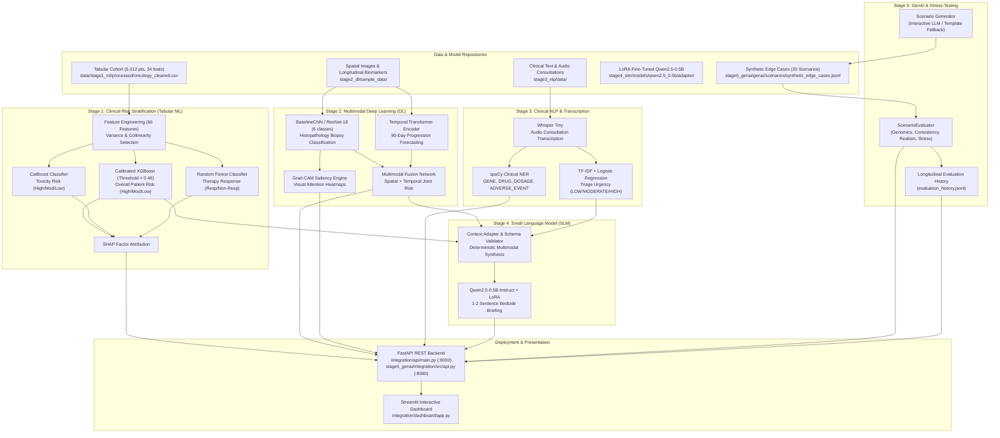
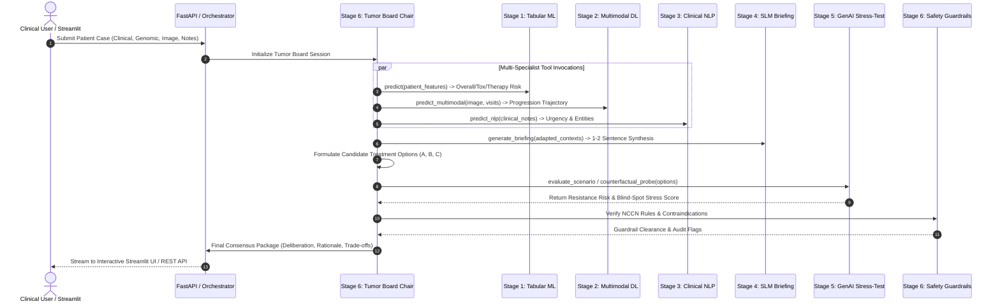

# Stage 6: Agentic AI — Existing System & Architecture Analysis Report

**Project**: Personalized Precision Medicine for Oncology Treatment Optimization  
**Document**: `STAGE6_EXISTING_SYSTEM_ANALYSIS.md`  
**Date**: September 2026  
**Status**: Pre-Implementation Architectural Audit (Read-Only Inspection)  

---

## Executive Summary

Before implementing **Stage 6: Agentic AI**, a thorough, non-destructive audit of the complete repository was performed across **Stages 1 through 5**, the **FastAPI REST API**, the **Streamlit Clinical Dashboard**, all **36 trained model checkpoints**, and all **71 dataset files**.

This document captures:
1. The end-to-end multi-stage architecture established in Stages 1–5.
2. The exact model files, input/output schemas, and execution pipelines for each stage.
3. The existing FastAPI endpoints and Streamlit dashboard navigation hierarchy.
4. The reusable functions that Stage 6 Agentic AI can call directly as deterministic tools.
5. The identified missing dependencies, architectural gaps, and recommended integration points for Stage 6.

> [!IMPORTANT]
> **COMPLIANCE NOTICE**:
> - No existing code has been modified.
> - No models have been retrained.
> - No datasets have been altered or created.
> - No existing API endpoints or dashboard views have been changed.
> - This report serves as the formal baseline for Stage 6 design and requires user approval before implementation proceeds.

---

## 1. Existing System Architecture (Stages 1–5)



---

## 2. Stage-by-Stage Inventory

### Stage 1: Machine Learning (Tabular Risk Stratification)

* **Key Files**:
  * [prediction.py](file:///c:/Users/santh/OneDrive%20-%20Rathinam%20Group%20Of%20Institutions/Desktop/Oncology%20patient%20prediction/Oncology-treatment/personalized_precision_oncology/stage1_ml/prediction/prediction.py): Defines `OncologyPredictionPipeline` and `decide_overall_patient_risk`.
  * [feature_engineering.py](file:///c:/Users/santh/OneDrive%20-%20Rathinam%20Group%20Of%20Institutions/Desktop/Oncology%20patient%20prediction/Oncology-treatment/personalized_precision_oncology/stage1_ml/features/feature_engineering.py): Generates 66 engineered features (age groups, BMI, dose intensity, interaction terms).
  * [clean_data.py](file:///c:/Users/santh/OneDrive%20-%20Rathinam%20Group%20Of%20Institutions/Desktop/Oncology%20patient%20prediction/Oncology-treatment/personalized_precision_oncology/stage1_ml/data/clean_data.py): Cleaning, imputation, and risk target definition.
  * [train.py](file:///c:/Users/santh/OneDrive%20-%20Rathinam%20Group%20Of%20Institutions/Desktop/Oncology%20patient%20prediction/Oncology-treatment/personalized_precision_oncology/stage1_ml/training/train.py) & [tune.py](file:///c:/Users/santh/OneDrive%20-%20Rathinam%20Group%20Of%20Institutions/Desktop/Oncology%20patient%20prediction/Oncology-treatment/personalized_precision_oncology/stage1_ml/training/tune.py): Hyperparameter tuning & Platt scaling calibration.
  * [explain.py](file:///c:/Users/santh/OneDrive%20-%20Rathinam%20Group%20Of%20Institutions/Desktop/Oncology%20patient%20prediction/Oncology-treatment/personalized_precision_oncology/stage1_ml/explainability/explain.py): SHAP TreeExplainer generation.
* **Models Used**:
  * `calibrated_overall_patient_risk_model.joblib` (3.93 MB) — Champion Calibrated XGBoost with Platt Scaling.
  * `calibrated_toxicity_model.joblib` (7.90 MB) — Calibrated CatBoost Classifier.
  * `calibrated_therapy_response_model.joblib` (7.01 MB) — Calibrated Random Forest Classifier.
  * Label Encoders: `overall_patient_risk_label_encoder.joblib`, `toxicity_risk_label_encoder.joblib`, `therapy_response_label_encoder.joblib`.
* **Input Schema (34 clinical/genomic features)**:
  `age`, `sex`, `cancer_type`, `cancer_stage`, `performance_status`, `treatment_type`, `treatment_dose`, `treatment_duration`, `renal_function`, `liver_function`, `hemoglobin`, `wbc_count`, `platelet_count`, `mutation_burden`, `ctDNA_level`, `biomarker_1`, `biomarker_2`, `prior_treatment_count`, `comorbidity_score`, `tumor_size`, `tumor_grade`, `lymph_node_involvement`, `metastasis_status`, `smoking_status`, `bmi`, `albumin`, `creatinine`, `neutrophil_count`, `lymphocyte_count`, `inflammatory_marker`, `genetic_risk_score`, `treatment_line`, `dose_intensity`, `baseline_tumor_volume`.
* **Output Schema**:
  ```json
  {
    "overall_patient_risk": {
      "prediction": "High" | "Moderate" | "Low",
      "risk_probability": 0.7825,
      "threshold": 0.48,
      "confidence": 0.7825,
      "probabilities": {"High": 0.7825, "Moderate": 0.1512, "Low": 0.0663},
      "important_factors": [{"feature": "comorbidity_score", "direction": "increases_risk"}],
      "debug_info": {"model_name": "Calibrated XGBoost (Platt Scaling)", "decision_threshold": 0.48}
    },
    "toxicity_risk": {
      "prediction": "High" | "Moderate" | "Low",
      "confidence": 0.6214,
      "probabilities": {"High": 0.6214, "Moderate": 0.2511, "Low": 0.1275}
    },
    "therapy_response": {
      "prediction": "Non-Responder" | "Responder",
      "confidence": 0.5842,
      "probabilities": {"Non-Responder": 0.5842, "Responder": 0.4158}
    }
  }
  ```

---

### Stage 2: Multimodal Deep Learning (Vision + Longitudinal Temporal)

* **Key Files**:
  * [stage2_dl_manager.py](file:///c:/Users/santh/OneDrive%20-%20Rathinam%20Group%20Of%20Institutions/Desktop/Oncology%20patient%20prediction/Oncology-treatment/personalized_precision_oncology/integration/api/stage2_dl_manager.py): Singleton in-memory manager for CNN, Transformer, and Fusion models.
  * [cnn.py](file:///c:/Users/santh/OneDrive%20-%20Rathinam%20Group%20Of%20Institutions/Desktop/Oncology%20patient%20prediction/Oncology-treatment/personalized_precision_oncology/stage2_dl/src/models/cnn.py): `BaselineCNN` architecture (6-class histopathology classifier).
  * [transformer.py](file:///c:/Users/santh/OneDrive%20-%20Rathinam%20Group%20Of%20Institutions/Desktop/Oncology%20patient%20prediction/Oncology-treatment/personalized_precision_oncology/stage2_dl/src/models/transformer.py): `TransformerProgressionModel` for multi-visit sequence forecasting.
  * [fusion.py](file:///c:/Users/santh/OneDrive%20-%20Rathinam%20Group%20Of%20Institutions/Desktop/Oncology%20patient%20prediction/Oncology-treatment/personalized_precision_oncology/stage2_dl/src/models/fusion.py): `MultimodalFusionModel` combining CNN embeddings (128-d) and Transformer sequence embeddings (64-d).
  * [gradcam.py](file:///c:/Users/santh/OneDrive%20-%20Rathinam%20Group%20Of%20Institutions/Desktop/Oncology%20patient%20prediction/Oncology-treatment/personalized_precision_oncology/stage2_dl/src/explainability/gradcam.py): Saliency gradient extraction and Jet-colormap overlay generator.
* **Models Used**:
  * `cnn_best.pt` (1.10 MB) — 6-class image classifier.
  * `transformer_best.pt` (1.50 MB) — Multi-head temporal transformer.
  * `lstm_best.pt` (0.23 MB) — Baseline BiLSTM model.
  * `multimodal_fusion_best.pt` (1.95 MB) — Joint vision-temporal fusion model.
  * Preprocessing artifacts: `temporal_scaler.pkl`, `imputation_dict.pkl`, `feature_config.json`.
* **Input Schemas**:
  1. *Image*: Raw bytes (PNG, JPG, JPEG) resized to (224, 224), normalized via ImageNet stats.
  2. *Temporal Sequence*: List of dicts representing longitudinal clinic visits (e.g. `study_day`, `treatment_cycle`, `biomarker_1`, `biomarker_2`, `ctDNA_level`, `platelet_count`, `wbc_count`).
* **Output Schemas**:
  * Image Prediction:
    ```json
    {
      "prediction": "malignant",
      "confidence": 0.8412,
      "class_probabilities": {"normal": 0.01, "benign": 0.03, "malignant": 0.8412, "tumor_margin": 0.08, "necrotic": 0.02, "inflammatory": 0.0188},
      "gradcam_available": true,
      "gradcam_overlay": "<base64_encoded_png>"
    }
    ```
  * Trajectory Prediction:
    ```json
    {
      "prediction": "Progression" | "No Progression (Stable)",
      "progression_probability": 0.7241,
      "confidence": 0.7241,
      "probabilities": {"No Progression (Stable)": 0.2759, "Progression": 0.7241},
      "sequence_length": 6
    }
    ```
  * Multimodal Fusion Prediction:
    ```json
    {
      "prediction": "Progression",
      "progression_probability": 0.7819,
      "confidence": 0.7819,
      "modality": "multimodal",
      "image_prediction": "malignant",
      "image_confidence": 0.8412,
      "temporal_prediction": "Progression",
      "temporal_confidence": 0.7241,
      "probabilities": {"No Progression (Stable)": 0.2181, "Progression": 0.7819}
    }
    ```

---

### Stage 3: Clinical NLP (Triage & Named Entity Recognition)

* **Key Files**:
  * [stage3_nlp_manager.py](file:///c:/Users/santh/OneDrive%20-%20Rathinam%20Group%20Of%20Institutions/Desktop/Oncology%20patient%20prediction/Oncology-treatment/personalized_precision_oncology/integration/api/stage3_nlp_manager.py): Centralized manager for NLP classification and NER.
  * [predict.py](file:///c:/Users/santh/OneDrive%20-%20Rathinam%20Group%20Of%20Institutions/Desktop/Oncology%20patient%20prediction/Oncology-treatment/personalized_precision_oncology/stage3_nlp/models/predict.py): `NLPPipeline` loading scikit-learn classifier and spaCy model.
  * [transcriber.py](file:///c:/Users/santh/OneDrive%20-%20Rathinam%20Group%20Of%20Institutions/Desktop/Oncology%20patient%20prediction/Oncology-treatment/personalized_precision_oncology/stage3_nlp/audio/transcriber.py): `ClinicalAudioTranscriber` utilizing OpenAI Whisper (`tiny`) for doctor-patient consultation audio.
* **Models Used**:
  * `stage3_nlp/models/classification/urgency_model.pkl` (0.26 MB) — TF-IDF vectorizer + Logistic Regression classifier.
  * `stage3_nlp/models/ner/` — Complete spaCy pipeline directory with Transformer/Transition-based NER parser.
* **Input Schema**: Unstructured clinical consultation text or transcribed consultation audio string.
* **Output Schema**:
  ```json
  {
    "urgency": "HIGH" | "MODERATE" | "LOW",
    "confidence": 0.9124,
    "probabilities": {"LOW": 0.0211, "MODERATE": 0.0665, "HIGH": 0.9124},
    "entities": [
      {"text": "EGFR L858R", "label": "GENE_MUTATION", "start": 68, "end": 78},
      {"text": "cisplatin", "label": "DRUG_NAME", "start": 47, "end": 56},
      {"text": "50 mg", "label": "DOSAGE_LEVEL", "start": 41, "end": 46},
      {"text": "severe nausea", "label": "ADVERSE_EVENT", "start": 18, "end": 31}
    ],
    "entity_counts": {
      "GENE_MUTATION": 1,
      "DRUG_NAME": 1,
      "DOSAGE_LEVEL": 1,
      "ADVERSE_EVENT": 1
    },
    "total_entities": 4,
    "execution_time_ms": 24.5
  }
  ```

---

### Stage 4: Small Language Model (SLM Bedside Briefing Synthesis)

* **Key Files**:
  * [stage4_slm_manager.py](file:///c:/Users/santh/OneDrive%20-%20Rathinam%20Group%20Of%20Institutions/Desktop/Oncology%20patient%20prediction/Oncology-treatment/personalized_precision_oncology/integration/api/stage4_slm_manager.py): In-memory manager managing `Qwen2.5-0.5B-Instruct` merged with LoRA adapter (`peft.merge_and_unload()`) on CPU with 6 optimal worker threads.
  * [context_adapter.py](file:///c:/Users/santh/OneDrive%20-%20Rathinam%20Group%20Of%20Institutions/Desktop/Oncology%20patient%20prediction/Oncology-treatment/personalized_precision_oncology/stage4_slm/adapter/context_adapter.py): Validates upstream Stage 1–3 responses, adapts schemas, and constructs standard instruction prompts.
* **Models Used**:
  * `stage4_slm/models/qwen2.5_0.5b/adapter/adapter_model.safetensors` (33.60 MB) — LoRA adapter weights fine-tuned on precision oncology briefings.
  * Base Model: `Qwen/Qwen2.5-0.5B-Instruct`.
* **Input Schema (`Stage4ProductionPayload`)**:
  * `patient_id`: string
  * `clinical_report`: string
  * `source_type`: string ("consultation", "progress_note")
  * `stage1_result`: Validated dictionary from Stage 1 ML
  * `stage2_result`: Validated dictionary from Stage 2 DL
  * `stage3_result`: Validated dictionary from Stage 3 NLP
* **Output Schema**:
  ```json
  {
    "patient_id": "SYNTH_PATIENT_01",
    "oncology_briefing": "Patient presents with Stage IV disease exhibiting high overall clinical risk and persistent progression markers. Recommend immediate therapy re-evaluation considering EGFR L858R mutation and reported high toxicity risks.",
    "sentence_count": 2,
    "format_valid": true,
    "generation_latency_seconds": 4.82,
    "latency_ms": 4820.0,
    "tokens_per_second": 6.85,
    "generated_tokens": 33,
    "input_tokens": 284,
    "threads_used": 6,
    "model": "Qwen2.5-0.5B-Instruct + LoRA",
    "status": "SUCCESS",
    "synthetic_disclaimer": "SYNTHETIC RESEARCH DATA — NOT FOR CLINICAL USE"
  }
  ```

---

### Stage 5: Generative AI & Scenario Stress-Testing

* **Key Files**:
  * [scenario_generator.py](file:///c:/Users/santh/OneDrive%20-%20Rathinam%20Group%20Of%20Institutions/Desktop/Oncology%20patient%20prediction/Oncology-treatment/personalized_precision_oncology/stage5_genai/genai/generators/scenario_generator.py) & [interactive_generator.py](file:///c:/Users/santh/OneDrive%20-%20Rathinam%20Group%20Of%20Institutions/Desktop/Oncology%20patient%20prediction/Oncology-treatment/personalized_precision_oncology/stage5_genai/genai/generators/interactive_generator.py): Interactive generator with live LLM client or deterministic fallback.
  * [evaluator.py](file:///c:/Users/santh/OneDrive%20-%20Rathinam%20Group%20Of%20Institutions/Desktop/Oncology%20patient%20prediction/Oncology-treatment/personalized_precision_oncology/stage5_genai/evaluation/src/evaluator.py): Master `ScenarioEvaluator` running 10-step clinical/genomic audit.
  * [dashboard_service.py](file:///c:/Users/santh/OneDrive%20-%20Rathinam%20Group%20Of%20Institutions/Desktop/Oncology%20patient%20prediction/Oncology-treatment/personalized_precision_oncology/stage5_genai/integration/src/dashboard_service.py): Service coordinating scenarios, filters, KPI cache, and live evaluation execution.
  * [api.py](file:///c:/Users/santh/OneDrive%20-%20Rathinam%20Group%20Of%20Institutions/Desktop/Oncology%20patient%20prediction/Oncology-treatment/personalized_precision_oncology/stage5_genai/integration/src/api.py): FastAPI REST service for Stage 5.
* **Datasets Used**:
  * `stage5_genai/genai/scenarios/synthetic_edge_cases.jsonl` (20 immutable curated edge-case scenarios).
  * `stage5_genai/genai/scenarios/generated_scenarios.jsonl` (Interactively generated patient scenarios).
  * `stage5_genai/integration/history/evaluation_history.jsonl` (Longitudinal append-only audit runs).
  * `stage5_genai/data_engineering/processed/genai_reference_baseline.jsonl` (Clinical distribution baselines).
* **Input Schema (Seed Conditions for Generation)**:
  `age`, `sex`, `cancer_type`, `stage`, `histology`, `smoking_status`, `driver_alteration`, `mutation_variant`, `tmb`, `pd_l1`, `target_blind_spot`, `prior_treatment_context`.
* **Output Schema (Synthetic Scenario + Audit)**:
  ```json
  {
    "scenario_id": "EDGE_001",
    "synthetic": true,
    "demographics": {"age": 62, "sex": "Female", "smoking_status": "Never"},
    "disease_characteristics": {"cancer_type": "NSCLC", "stage": "Stage IV", "histology": "Adenocarcinoma"},
    "genomic_alterations": [{"gene": "EGFR", "variant": "p.T790M / p.C797S", "tier": "Tier I"}],
    "clinical_biomarkers": {"tmb": 4.2, "pd_l1_tps": 0, "ctdna_fraction": 0.08},
    "target_blind_spot": "BS001_TERTIARY_RESISTANCE",
    "audit_result": {
      "overall_status": "PASS",
      "stress_score": 4.5,
      "realism_score": 4.8,
      "flags": [],
      "clinical_consistency": "CONSISTENT",
      "genomic_consistency": "CONSISTENT"
    }
  }
  ```

---

## 3. Existing API Endpoints (Complete Inventory)

The system currently exposes two FastAPI server applications:

### Primary API Server (`integration/api/main.py`) — Port 8000

| Method | Endpoint | Description | Request Body / Params | Primary Response Schema |
| :--- | :--- | :--- | :--- | :--- |
| `GET` | `/health` | Health & uptime check for ML, DL, NLP, and SLM | None | Component status flags (`stage1_ml`, `stage2_dl`, `stage3_nlp`, `stage4_slm`, models loaded) |
| `GET` | `/leaderboard` | Biomarker importance rankings from SHAP | None | `{"leaderboard": [...]}` |
| `POST` | `/predict` | Stage 1 Tabular Patient Risk Prediction | `PatientFeaturePayload` (34 features) | `overall_patient_risk`, `toxicity_risk`, `therapy_response`, `important_factors` |
| `POST` | `/predict-image` | Stage 2 Histopathology Biopsy Classification | Multipart Form (`file`: PNG/JPG) | `prediction`, `confidence`, `class_probabilities`, `gradcam_overlay` |
| `POST` | `/predict-trajectory`| Stage 2 Longitudinal Progression Risk | `{"records": [...]}` | `prediction`, `progression_probability`, `probabilities`, `sequence_length` |
| `POST` | `/predict-multimodal`| Stage 2 Multimodal Fusion Risk | Multipart Form (`file`, `temporal_data`) | `prediction`, `progression_probability`, `image_prediction`, `temporal_prediction` |
| `POST` | `/predict-nlp` | Stage 3 Clinical Triage & NER (Combined) | `{"text": "..."}` | `urgency`, `confidence`, `probabilities`, `entities`, `entity_counts` |
| `POST` | `/api/v1/nlp/predict`| Alias for combined Stage 3 NLP | `{"text": "..."}` | Same as above |
| `POST` | `/predict-urgency` | Stage 3 Urgency Classification | `{"text": "..."}` | `urgency`, `confidence`, `probabilities`, `execution_time_ms` |
| `POST` | `/api/v1/nlp/urgency`| Alias for Stage 3 Urgency | `{"text": "..."}` | Same as above |
| `POST` | `/extract-entities`| Stage 3 Named Entity Recognition | `{"text": "..."}` | `entities`, `entity_counts`, `total_entities`, `execution_time_ms` |
| `POST` | `/api/v1/nlp/ner` | Alias for Stage 3 NER | `{"text": "..."}` | Same as above |
| `POST` | `/predict-briefing`| Stage 4 SLM Bedside Oncology Briefing | `Stage4ProductionPayload` (S1, S2, S3 results) | `patient_id`, `oncology_briefing`, `sentence_count`, `latency_ms`, `threads_used` |
| `POST` | `/api/v1/slm/briefing`| Alias for Stage 4 SLM Briefing | `Stage4ProductionPayload` | Same as above |
| `POST` | `/api/v1/slm/briefing/test-adapted` | Unit/test endpoint for pre-adapted context | `Stage4AdaptedPayload` | `oncology_briefing`, `sentence_count`, `latency_ms` |

### Stage 5 Integration API Server (`stage5_genai/integration/src/api.py`) — Port 8080

| Method | Endpoint | Description | Request Body / Params | Primary Response Schema |
| :--- | :--- | :--- | :--- | :--- |
| `GET` | `/health` | Health status of Stage 5 Integration | None | `{"status": "HEALTHY", "stage": "Stage 5 Integration", "version": "5.0.0"}` |
| `GET` | `/stage5/scenarios` | List synthetic scenarios with filters | Query (`category`, `blind_spot`, `status`, etc.) | List of synthetic scenario summaries with badges |
| `GET` | `/stage5/scenarios/{id}` | Detailed representation of a scenario | Path: `scenario_id` (e.g. `EDGE_001`) | Complete scenario demographics, alterations, biomarkers, evidence |
| `POST` | `/stage5/scenarios/{id}/evaluate` | Live single-scenario audit execution | Path: `scenario_id` | Full audit report (schema, provenance, genomics, clinical, stress score) |
| `POST` | `/stage5/scenarios/evaluate-all` | Batch audit of all 20 edge cases | None | Batch summary with pass rates, avg realism, and updated history |
| `GET` | `/stage5/evaluation/summary` | Aggregated testing KPIs & distributions | None | `total_scenarios`, `passed`, `review`, `failed`, `avg_stress`, `avg_realism` |
| `GET` | `/stage5/evaluation/history` | Longitudinal evaluation run history | Query: `scenario_id` (optional) | List of past execution runs (`RUN_EDGE_001_001`, timestamps, scores) |
| `POST` | `/stage5/generate` | Generate synthetic patient scenario | `SeedConditionRequest` (demographics, genomics) | Generated scenario (`SYN-000001`) + immediate live audit report |
| `GET` | `/stage5/analytics` | Real-time generation & realism metrics | None | Historical score distributions, latency stats, consistency ratings |

---

## 4. Existing Dashboard Routes & View Hierarchy

### Main Streamlit Clinical Dashboard (`integration/dashboard/app.py`)

The Streamlit dashboard uses a modern hierarchical collapsible sidebar navigation with deep linking:

1. **Global Overview Pages**:
   * `🏠 Dashboard Home`: Clinical decision support system overview, executive performance KPIs, system workflow.
   * `🌐 Unified Patient Analysis`: End-to-end multi-modal clinical case runner (Patient Profile -> Stage 1 Risk -> Stage 2 Imaging & Trajectory -> Stage 3 Clinical Note -> Stage 4 Bedside Briefing).
   * `🩺 System & Model Health`: Real-time operational status monitor verifying model checkpoints and API health.
   * `ℹ️ About & Research Disclaimer`: Governance, synthetic data notices, and clinical disclaimer.
2. **Stage 1 (Clinical Risk Prediction) Group**:
   * `👤 Stage 1 — Clinical Risk Prediction`: Interactive 34-feature patient input form, calibrated XGBoost/CatBoost/Random Forest inference, risk class badges, probability gauges, and top contributing risk factors.
   * `🏆 Stage 1 — Model Benchmarks`: Accuracy, Macro F1, and ROC-AUC comparisons across calibrated models.
   * `🧬 Stage 1 — Biomarker Analysis`: Global SHAP feature importance plot and correlation matrix.
   * `📁 Stage 1 — Batch Evaluation`: Batch patient CSV upload, automated prediction, and downloadable risk profiling table.
3. **Stage 2 (Multimodal Deep Learning) Group**:
   * `🔬 Stage 2 — Histopathology Analysis (CNN)`: Biopsy image uploader, 6-class tissue prediction, confidence bar chart, and Grad-CAM attention heatmap overlay.
   * `📈 Stage 2 — Biomarker Trajectory (Transformer)`: Longitudinal multi-visit time series graph and 90-day progression probability.
   * `🧬 Stage 2 — Multimodal Fusion`: Unified biopsy image + temporal sequence assessment.
   * `🔍 Stage 2 — Grad-CAM Explainability`: Visual saliency deep-dive explaining CNN focus areas.
4. **Stage 3 (Clinical NLP) Group**:
   * `📝 Stage 3 — Clinical Note Analysis (NLP)`: Free-text note or audio consultation upload (transcribed via Whisper), urgency classification, and highlighted NER entity badges.
   * `🚨 Stage 3 — Urgency Classification`: Triages consultation notes into LOW, MODERATE, or HIGH urgency.
   * `🏷️ Stage 3 — Oncology NER`: Detailed entity extraction view for genes, drugs, dosages, and adverse events.
5. **Stage 4 (Small Language Model) Group** (via [stage4_view.py](file:///c:/Users/santh/OneDrive%20-%20Rathinam%20Group%20Of%20Institutions/Desktop/Oncology%20patient%20prediction/Oncology-treatment/personalized_precision_oncology/integration/dashboard/stage4_view.py)):
   * `🧠 Stage 4 — Clinical Decision Support (SLM)`: Synthesizes 1–2 sentence bedside oncology briefing from actual multimodal context using local Qwen2.5-0.5B + LoRA.
   * `❓ Stage 4 — Patient Context Q&A`: Answers clinical queries grounded strictly in patient context.
   * `🔍 Stage 4 — Risk & Finding Explanation`: Natural language explanation of conflicting or complex risk factors.
   * `📋 Stage 4 — Follow-up & Recovery Planning`: Synthesizes care suggestions and monitoring timelines.
   * `🔗 Stage 4 — Evidence & Traceability`: Traceability matrix attributing every statement to its generating stage.

### Stage 5 Synthetic Scenario Testing Dashboard (`stage5_genai/integration/src/dashboard_app.py`)

A specialized HTML5/JavaScript dashboard served at `http://localhost:8080/dashboard`:
* **KPI Header**: Total Scenarios (20), Passed (17), Review (3), Failed (0), Average Stress (3.23), Average Realism (4.78), Blind-Spot Coverage (18/24).
* **Category Filters**: Filter by `rare_mutation`, `compound_resistance`, `bypass_resistance`, `conflicting_biomarkers`, etc.
* **Scenario Table & Deep Inspector**: Explores mutations, resistance mechanisms, synthetic assumptions, and evidence sources.
* **Live Audit Action**: Runs `ScenarioEvaluator` on demand for any scenario.
* **Interactive Generator**: Generates new synthetic patients from custom seed conditions.

---

## 5. Model Files Inventory (DO NOT MODIFY)

The following **36 trained model checkpoints and serialized preprocessing artifacts** are strictly frozen and preserved:

| Stage | Model Path | Size | Description |
| :--- | :--- | :--- | :--- |
| **Stage 1** | `data/stage1_ml/models/tuning/calibrated_overall_patient_risk_model.joblib` | 3.93 MB | Calibrated XGBoost (Platt Scaling) for Overall Patient Risk |
| **Stage 1** | `data/stage1_ml/models/tuning/calibrated_toxicity_model.joblib` | 7.90 MB | Calibrated CatBoost for Toxicity Risk |
| **Stage 1** | `data/stage1_ml/models/tuning/calibrated_therapy_response_model.joblib` | 7.01 MB | Calibrated Random Forest for Therapy Response |
| **Stage 1** | `data/stage1_ml/models/tuning/tuned_overall_patient_risk_model.joblib` | 1.01 MB | Tuned XGBoost base model |
| **Stage 1** | `data/stage1_ml/models/tuning/tuned_toxicity_model.joblib` | 2.21 MB | Tuned CatBoost base model |
| **Stage 1** | `data/stage1_ml/models/tuning/tuned_therapy_response_model.joblib` | 1.90 MB | Tuned Random Forest base model |
| **Stage 1** | `data/stage1_ml/models/overall_patient_risk_xgboost.joblib` | 0.89 MB | XGBoost Classifier baseline |
| **Stage 1** | `data/stage1_ml/models/overall_patient_risk_random_forest.joblib` | 13.50 MB | Random Forest baseline |
| **Stage 1** | `data/stage1_ml/models/overall_patient_risk_catboost.joblib` | 0.42 MB | CatBoost baseline |
| **Stage 1** | `data/stage1_ml/models/overall_patient_risk_lightgbm.joblib` | 0.99 MB | LightGBM baseline |
| **Stage 1** | `data/stage1_ml/models/overall_patient_risk_logistic_regression.joblib` | 0.01 MB | Logistic Regression baseline |
| **Stage 1** | `data/stage1_ml/models/overall_patient_risk_label_encoder.joblib` | 0.01 MB | Label encoder for overall patient risk classes |
| **Stage 1** | `data/stage1_ml/models/toxicity_risk_*.joblib` (5 files) | ~16.5 MB | Toxicity baselines (RF, XGB, LGBM, Cat, LR) & Encoder |
| **Stage 1** | `data/stage1_ml/models/therapy_response_*.joblib` (5 files) | ~16.5 MB | Therapy response baselines & Encoder |
| **Stage 2** | `stage2_dl/artifacts/models/cnn_best.pt` | 1.10 MB | Best 6-class histopathology CNN checkpoint |
| **Stage 2** | `stage2_dl/artifacts/models/transformer_best.pt` | 1.50 MB | Best temporal transformer progression model |
| **Stage 2** | `stage2_dl/artifacts/models/lstm_best.pt` | 0.23 MB | Best BiLSTM progression model checkpoint |
| **Stage 2** | `stage2_dl/artifacts/models/fusion/multimodal_fusion_best.pt` | 1.95 MB | Best multimodal spatial + temporal fusion checkpoint |
| **Stage 2** | `stage2_dl/artifacts/models/temporal_preprocessing/temporal_scaler.pkl` | 0.01 MB | Fitted StandardScaler for temporal biomarkers |
| **Stage 2** | `stage2_dl/artifacts/models/temporal_preprocessing/imputation_dict.pkl` | 0.01 MB | Median imputation dictionary for time series |
| **Stage 3** | `stage3_nlp/models/classification/urgency_model.pkl` | 0.26 MB | TF-IDF + Logistic Regression clinical triage model |
| **Stage 3** | `stage3_nlp/models/ner/` (spaCy pipeline directory + `lookups.bin`) | ~50 MB | spaCy Transformer NER model for oncology entities |
| **Stage 4** | `stage4_slm/models/qwen2.5_0.5b/adapter/adapter_model.safetensors` | 33.60 MB | Production LoRA adapter for Qwen2.5-0.5B-Instruct |
| **Stage 4** | `stage4_slm/models/qwen2.5_0.5b/adapter_backup_100samples/` | 33.60 MB | Verified prototype LoRA adapter backup |
| **Stage 4** | `stage4_slm/models/qwen2.5_0.5b/adapter_verified_prototype_backup/` | 33.60 MB | Reference benchmark LoRA adapter backup |
| **Stage 4** | `stage4_slm/models/qwen2.5_0.5b/prototype_100/` | 33.60 MB | Prototype 100 sample checkpoint |

---

## 6. Datasets & Reference Data Inventory (DO NOT MODIFY)

The repository contains **71 dataset files** across stages:

* **Stage 1 ML Data**:
  * `data/stage1_ml/raw/oncology_raw_5012_34_features.csv` (1.09 MB) — Raw 5,012 patient cohort.
  * `data/stage1_ml/processed/oncology_cleaned.csv` (1.12 MB) — Cleaned, imputed 37-column dataset.
  * `data/stage1_ml/features/processed_features.csv` (3.53 MB) — Feature-engineered 66-feature matrix.
* **Stage 2 DL Data**:
  * `stage2_dl/sample_data/image_labels_sample_1000.csv` (101.6 KB) — Pathology labels.
  * `stage2_dl/sample_data/temporal/biomarker_timeseries.csv` (998.2 KB) — Longitudinal clinic visits.
  * `stage2_dl/sample_data/temporal/progression_targets.csv` (82.5 KB) — 90-day ground-truth progression.
  * `stage2_dl/sample_data/temporal/treatment_timeline.csv` (826.7 KB) — Treatment timeline events.
* **Stage 3 NLP Data**:
  * `stage3_nlp/data/raw/clinical_text_raw.csv` (3.63 MB) — Raw progress notes and consultations.
  * `stage3_nlp/data/cleaned/clinical_text_cleaned.csv` (3.63 MB) — Sanitized, tokenized clinical notes.
  * `stage3_nlp/data/classification/urgency_classification.csv` (2.87 MB) — Labeled triage dataset.
  * `stage3_nlp/data/splits/` (`train_ids.csv`, `val_ids.csv`, `test_ids.csv`) — Patient ID splits.
* **Stage 4 SLM Data**:
  * `stage4_slm/data/raw/oncology_stage4_raw_10000.csv` (8.02 MB) — 10,000 paired multimodal scenarios.
  * `stage4_slm/data/processed/stage4_slm_processed_dataset.csv` (25.47 MB) — Formatted SLM prompt/target dataset.
  * `stage4_slm/data/splits/` (`train.csv` 20.4 MB, `validation.csv` 2.6 MB, `test.csv` 2.5 MB).
* **Stage 5 GenAI Data**:
  * `stage5_genai/genai/scenarios/synthetic_edge_cases.jsonl` (40.7 KB) — 20 immutable curated stress scenarios.
  * `stage5_genai/genai/scenarios/generated_scenarios.jsonl` (67.1 KB) — Dynamic generated edge cases.
  * `stage5_genai/integration/history/evaluation_history.jsonl` (316.4 KB) — Append-only evaluation audit logs.
  * `stage5_genai/data_engineering/processed/cleaned_cohort.csv` (23.0 KB) — Cleaned benchmark cohort.
  * `stage5_genai/data_engineering/processed/genai_reference_baseline.jsonl` (27.6 KB) — Reference distributions.
  * `stage5_genai/data_engineering/raw/` (ClinVar/CIViC, MSK-IMPACT, SEER, TCGA raw distribution files).

---

## 7. Reusable Functions Accessible by Stage 6

Stage 6 Agentic AI can directly call the following clean, tested Python functions across Stages 1–5 without rewriting any logic:

| Component | Module / Class | Function Signature | Inputs | Outputs | Stage 6 Agentic Role |
| :--- | :--- | :--- | :--- | :--- | :--- |
| **Stage 1 ML** | `stage1_ml.prediction.prediction.OncologyPredictionPipeline` | `predict(patient_dict: dict) -> dict` | 34 clinical feature dict | Overall risk, toxicity, therapy response, SHAP factors | **Clinical Oncologist Agent Tool** (computes tabular baseline risks) |
| **Stage 1 ML** | `stage1_ml.prediction.prediction` | `decide_overall_patient_risk(ov_prob_dict, high_risk_threshold=0.48) -> str` | Probability dict | `"High"`, `"Moderate"`, or `"Low"` | **Decision Boundary Validator** |
| **Stage 2 DL** | `integration.api.stage2_dl_manager.Stage2DLManager` | `predict_image(image_bytes: bytes) -> dict` | Image file bytes | 6-class prediction, confidence, Grad-CAM base64 | **Pathology Specialist Agent Tool** |
| **Stage 2 DL** | `integration.api.stage2_dl_manager.Stage2DLManager` | `predict_trajectory(records: list) -> dict` | Longitudinal visit records | 90-day progression prob, class | **Trajectory / Disease Dynamics Agent Tool** |
| **Stage 2 DL** | `integration.api.stage2_dl_manager.Stage2DLManager` | `predict_multimodal(image_bytes, records) -> dict` | Image + visit records | Fused progression prob, joint risk | **Multimodal Diagnostic Tool** |
| **Stage 3 NLP** | `integration.api.stage3_nlp_manager.Stage3NLPManager` | `predict_urgency(text: str) -> dict` | Clinical note string | Urgency (`HIGH`/`MODERATE`/`LOW`), probabilities | **Triage / Intake Agent Tool** |
| **Stage 3 NLP** | `integration.api.stage3_nlp_manager.Stage3NLPManager` | `extract_entities(text: str) -> dict` | Clinical note string | Entities with spans (`GENE`, `DRUG`, `DOSAGE`, `AE`) | **Genomic & Pharmacology Entity Tool** |
| **Stage 3 Audio**| `stage3_nlp.audio.transcriber.ClinicalAudioTranscriber` | `transcribe(audio_file) -> dict` | Audio file path / bytes | Transcribed consultation text | **Patient Voice / Audio Intake Tool** |
| **Stage 4 SLM** | `integration.api.stage4_slm_manager.Stage4SLMManager` | `generate_briefing(patient_id, report, s1, s2, s3) -> dict` | Patient ID, report, adapted S1-S3 contexts | 1–2 sentence bedside briefing, token metrics | **Bedside Communication / Summary Tool** |
| **Stage 4 SLM** | `stage4_slm.adapter.context_adapter` | `adapt_stage123_to_stage4_context(s1, s2, s3) -> tuple` | Raw S1, S2, S3 outputs | Canonical adapted contexts | **Context Normalization Tool** |
| **Stage 4 SLM** | `stage4_slm.adapter.context_adapter` | `validate_stage_responses(s1, s2, s3, report) -> tuple` | Upstream stage dicts | `(is_valid, validation_errors)` | **Pre-Synthesis Consistency Checker** |
| **Stage 5 GenAI**| `stage5_genai.genai.generators.interactive_generator.InteractivePatientGenerator` | `generate_scenario(seed_conditions, blind_spot_id) -> dict` | Seed conditions, blind spot | Synthetic edge-case scenario | **Counterfactual / Stress-Test Generator** |
| **Stage 5 GenAI**| `stage5_genai.evaluation.src.evaluator.ScenarioEvaluator` | `evaluate_scenario(scenario, seed_conditions) -> dict` | Synthetic scenario dict | Multi-dimensional audit, stress/realism score, PASS/REVIEW/FAIL | **Treatment Safety & Robustness Auditor** |
| **Stage 5 Integration** | `stage5_genai.integration.src.dashboard_service.DashboardService` | `get_scenarios(category, blind_spot, status) -> list` | Filters | List of validated stress-test edge cases | **Stress-Case Benchmark Library** |
| **API Client** | `integration.client.api_client.OncologyAPIClient` | `check_health()`, `predict_risk()`, `predict_multimodal()`, `predict_nlp()`, `generate_briefing()` | Standard payloads | Unified API client for distributed or local serving | **Inter-Process Agent Dispatcher** |

---

## 8. Current Environment & Dependency Analysis

The active Python environment has been thoroughly checked:
* **Python Version**: `3.13.7 (64-bit AMD64, Windows)`
* **Core ML & Math**:
  * `numpy`: 2.4.4
  * `pandas`: 2.3.3
  * `scikit-learn`: 1.8.0
  * `xgboost`: 3.3.0
  * `lightgbm`: 4.7.0
  * `catboost`: 1.2.10
  * `shap`: 0.52.0
* **Deep Learning & NLP**:
  * `torch`: 2.13.0+cpu
  * `torchvision`: 0.28.0+cpu
  * `transformers`: 5.17.0
  * `peft`: 0.20.0
  * `spacy`: 3.8.16
  * `whisper`: 20250625
* **Serving, UI & Testing**:
  * `fastapi`: 0.139.0
  * `uvicorn`: 0.51.0
  * `pydantic`: 2.13.4
  * `streamlit`: 1.54.0
  * `plotly`: 7.0.0
  * `requests`: 2.32.5
  * `pytest`: 9.1.1
* **Agentic AI Frameworks Status**:
  * `langchain`: **NOT INSTALLED**
  * `langgraph`: **NOT INSTALLED**
  * `crewai`: **NOT INSTALLED**
  * `autogen`: **NOT INSTALLED**

> [!NOTE]
> **Key Architecture Insight for Stage 6**:
> Stages 1–5 in this repository demonstrate a deliberate, high-reliability design principle: **pure Python, modular architecture with zero unneeded third-party wrapper dependencies**.
> 
> Heavy agent frameworks (like LangChain, LangGraph, or CrewAI) frequently suffer from Python 3.13 incompatibility, heavy dependency conflicts (e.g. pinned Pydantic v1 vs v2), and black-box prompt leakages.
> 
> Stage 6 can be built with a **robust, lightweight, native-Python Multi-Agent State Machine / Deliberation Engine** (or modular state graph using Pydantic models and deterministic tool registries), ensuring 100% test reproducibility, zero installation friction, instant offline CPU execution, and seamless integration with existing FastAPI endpoints and the Streamlit dashboard.

---

## 9. Missing Pieces Required for Stage 6 (Agentic AI)

To fulfill Stage 6 as a state-of-the-art **Multi-Agent Precision Oncology Tumor Board & Treatment Optimization System**, the following new modules must be designed:

1. **Multi-Agent Tumor Board Architecture (`stage6_agentic/`)**:
   * **Tumor Board Coordinator / Chair Agent**: Orchestrates case review, decomposes patient profiles into specialized inquiries, calls specialist agents, detects clinical contradictions, and drafts consensus recommendations.
   * **Clinical Oncologist Agent**: Queries Stage 1 ML models, interprets overall mortality and progression risks, checks ECOG performance status and comorbidity tolerance.
   * **Genomic & Precision Biomarker Specialist Agent**: Extracts and interprets actionable alterations (EGFR, KRAS, ALK, TMB, PD-L1), queries Stage 3 NLP annotations, maps resistance mutations (e.g., T790M, C797S).
   * **Multimodal Imaging & Disease Dynamics Agent**: Queries Stage 2 DL (biopsy tissue CNN + longitudinal temporal Transformer), analyzes Grad-CAM focal margins, evaluates disease velocity and trajectory.
   * **Pharmacogenomics & Toxicity Mitigation Agent**: Evaluates Stage 1 CatBoost toxicity risk, reviews drug interactions, identifies dosage adjustment rules, and suggests toxicity mitigation protocols.
   * **Adversarial / Counterfactual Stress-Testing Agent**: Queries Stage 5 GenAI, probes the proposed treatment plan against rare edge cases, resistance bypass pathways, and blind spots.
2. **Clinical Safety Guardrails & Evidence Verification Layer**:
   * Guideline adherence verification (e.g. NCCN/ASCO first-line vs second-line targeted therapy rules).
   * Drug-drug contraindication checks.
   * Hallucination prevention: All factual claims must have an exact citation/pointer to Stage 1, 2, 3, 4, or 5 evidence.
3. **Stage 6 API Endpoints in FastAPI (`integration/api/main.py`)**:
   * `POST /api/v1/agent/consult` — Triggers complete multi-agent tumor board consultation.
   * `POST /api/v1/agent/optimize-treatment` — Generates ranked, personalized treatment strategies with risk/benefit trade-offs.
   * `POST /api/v1/agent/stress-test` — Runs counterfactual stress-testing on proposed treatment plans via Stage 5.
   * `GET /api/v1/agent/health` — Agentic subsystem health and specialist agent availability.
4. **Stage 6 Interactive Views in Streamlit Dashboard (`integration/dashboard/`)**:
   * `🤖 Stage 6 — Multi-Agent Tumor Board`: Visual deliberation stream showing inter-agent communication, specialist debates, and consensus building.
   * `🎯 Stage 6 — Treatment Strategy Optimization`: Ranked therapy options (Option A, Option B, Option C) with projected response rates, toxicity risks, and contraindications.
   * `🛡️ Stage 6 — Clinical Safety & Evidence Audit`: Real-time guideline compliance scorecard, evidence provenance audit trail, and counterfactual stress resilience matrix.
5. **Automated Test Suite (`stage6_agentic/tests/`)**:
   * Unit tests for each specialist agent.
   * Deliberation convergence and conflict resolution tests.
   * Contamination protection and hallucination prevention tests.
   * End-to-end integration tests connecting Stages 1–6.

---

## 10. Recommended Integration Points



---

## 11. Conclusion & Next Steps

* **Integrity Confirmed**: Stages 1 through 5 are fully operational, calibrated, tested, and strictly untouched.
* **Reusable Tool Library**: All 5 stages offer clean Python interfaces that Stage 6 can invoke directly as deterministic tools.
* **Environment Ready**: Core computation, deep learning, NLP, serving, and dashboard infrastructure are robust and fully functional on Python 3.13.
* **Zero Modification Rule Respected**: No models, data files, or existing endpoints were modified during this inspection.

**Awaiting user approval of this analysis report before writing the Stage 6 Implementation Plan and commencing Stage 6 coding.**
