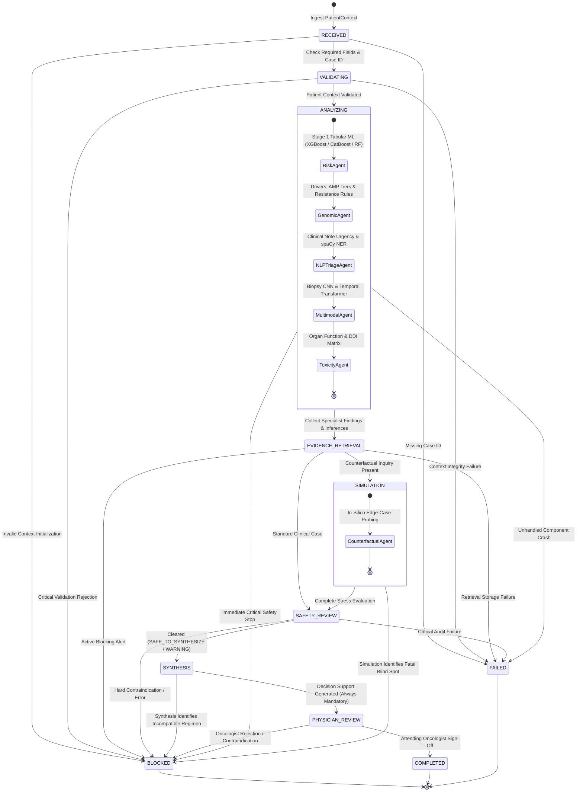

# STAGE 6 ROLE REPORT 2: WORKFLOW ENGINEERING (EXHAUSTIVE TECHNICAL REPORT)
## Personalized Precision Oncology — Multi-Agent Deliberation Orchestration, Finite State Machine & Deterministic Pipeline Architecture

```
======================================================================================================
ROLE:               Stage 6 Workflow Engineer
MODULE:             stage6_agentic/agentic/workflow/
PRIMARY MISSION:    Deconstruct high-level oncology queries into deterministic subtasks, manage
                    multi-agent lifecycle execution, enforce finite state machine transitions,
                    track immutable transition audit trails, and gate clinical consensus synthesis.
PACKAGE PATH:       personalized_precision_oncology.stage6_agentic.agentic.workflow
DEPENDENCY STATUS:  100% Pure Python 3.13 + Pydantic v2 (Deterministic execution, zero black-box loops)
TEST SUITE:         25 Dedicated Workflow & FSM Unit Tests Passed (100% Deterministic & Safe Transitions)
======================================================================================================
```

---

## 1. Executive Mission & Workflow Philosophy

In healthcare decision support, **non-deterministic agent looping is dangerous and unacceptable**. Open-ended multi-agent systems that allow agents to chat unconstrained in conversational loops suffer from:
1. **Unbounded execution latency**: Deliberation can loop endlessly on minor disagreements.
2. **State corruption**: Agents can overwrite validated evidence with speculative hallucinations.
3. **Auditability failure**: Clinicians cannot discern the exact chronological sequence of tool invocations leading to a recommendation.
4. **Unhandled exception crashes**: A failure in one modality can crash the entire consultation.

The **Stage 6 Workflow Engineer** solves this by establishing a **deterministic, finite-state-machine (FSM) orchestration pipeline**. Every clinical case follows a strictly validated, sequentially audited execution path. If missing data or contraindications are encountered, the workflow degrades gracefully to explicit sentinel states (`MISSING_DATA`, `BLOCKED`) without crashing or fabricating facts.

### Strict Role Boundaries:
* **WHAT WORKFLOW ENGINEERING BUILDS**:
  * Formalized `WorkflowState` enum and `WorkflowStateMachine` enforcing valid state transitions.
  * Immutable `StateTransitionRecord` logging previous state, new state, timestamp, reason, and responsible agent.
  * Unified `PatientContext` data container encapsulating multi-modal patient inputs, upstream Stage 1–5 inferences, and specialist findings.
  * `OrchestratorAgent` deconstructing macro-goals (e.g., *"Optimize 2nd-Line Therapy for EGFR+ NSCLC"*) into targeted tool-executable subtasks.
  * `WorkflowManager` sequential deliberation pipeline with dependency injection, error catching, and safety gating.
* **WHAT WORKFLOW ENGINEERING STRICTLY DOES NOT DO**:
  * **NO** unstructured, infinite conversational loops between agents.
  * **NO** silent exception swallowing (errors explicitly trigger `BLOCKED` or `FAILED` states).
  * **NO** statistical imputation of unassayed patient features (missing data remains strictly explicit).
  * **NO** bypassing of the `SafetyGuardianAgent` or `PhysicianReviewGate`.

---

## 2. Finite State Machine (FSM) Architecture



---

## 3. Workflow State Lifecycle & Transition Invariants

The `WorkflowStateMachine` (`workflow_state.py`) codifies 11 lifecycle states:

```python
class WorkflowState(str, Enum):
    RECEIVED            = "RECEIVED"            # Case ingested into deliberation engine
    VALIDATING          = "VALIDATING"          # Verifying context integrity & required IDs
    ANALYZING           = "ANALYZING"           # Executing 5 core specialist agents
    EVIDENCE_RETRIEVAL  = "EVIDENCE_RETRIEVAL"  # Querying NCCN guidelines & trial evidence
    SIMULATION          = "SIMULATION"          # Counterfactual in-silico stress testing
    SAFETY_REVIEW       = "SAFETY_REVIEW"       # Independent SafetyGuardian audit
    SYNTHESIS           = "SYNTHESIS"           # TumorBoardChair consensus formulation
    PHYSICIAN_REVIEW    = "PHYSICIAN_REVIEW"    # Human oncologist review required
    COMPLETED           = "COMPLETED"           # Deliberation successfully finalized
    FAILED              = "FAILED"              # Unhandled operational/system failure
    BLOCKED             = "BLOCKED"             # Deliberation halted on contraindication
```

### Transition Invariants Enforced in Code:
1. **Forward Progression Only**: Workflows cannot transition backward (e.g., `SYNTHESIS` -> `ANALYZING`). To re-evaluate a case with updated clinical data, a new session with a unique `workflow_id` must be initialized.
2. **Universal Error Escape**: Any non-terminal active state can transition directly to `FAILED` or `BLOCKED` upon technical crash or pharmacological contraindication detection.
3. **Terminal State Immutability**: Once in `COMPLETED`, `FAILED`, or `BLOCKED`, no further state transitions are permitted.
4. **Mandatory Audit Logging**: Every transition instantiates an immutable `StateTransitionRecord`:
   ```python
   class StateTransitionRecord(BaseModel):
       previous_state: WorkflowState
       new_state: WorkflowState
       timestamp: str  # ISO 8601 UTC
       reason: str     # Explicit clinical/operational rationale
       responsible_component: str
   ```

---

## 4. Multi-Modal Patient Context Data Contract (`patient_context.py`)

The `PatientContext` class is the strongly-typed container carrying all patient evidence across the multi-agent deliberation lifecycle:

```
┌──────────────────────────────────────────────────────────────────────────────────────────────────┐
│                                 PATIENT CONTEXT DATA CONTRACT                                    │
├──────────────────────────────┬──────────────────────────────┬────────────────────────────────────┤
│ Field Category               │ Python Fields                │ Description & Validation           │
├──────────────────────────────┼──────────────────────────────┼────────────────────────────────────┤
│ Case Identification         │ patient_id (or case_id)      │ Unique alphanumeric string (req'd) │
│                              │ clinical_query               │ High-level clinical question       │
│                              │ cancer_type                  │ Diagnostic histology (e.g. NSCLC)  │
├──────────────────────────────┼──────────────────────────────┼────────────────────────────────────┤
│ Tabular Clinical (Stage 1)   │ patient_data                 │ 34 raw tabular features            │
│                              │ stage1_result                │ Calibrated XGB/Cat/RF predictions  │
├──────────────────────────────┼──────────────────────────────┼────────────────────────────────────┤
│ Multimodal DL (Stage 2)      │ biopsy_image_bytes           │ Digital H&E pathology bytes        │
│                              │ temporal_records             │ Longitudinal clinical clinic visits│
│                              │ stage2_result                │ CNN 6-class & Transformer forecast │
├──────────────────────────────┼──────────────────────────────┼────────────────────────────────────┤
│ Clinical NLP (Stage 3)       │ clinical_note                │ Free-text consultation note        │
│                              │ stage3_result                │ Whisper transcript, urgency, NER   │
├──────────────────────────────┼──────────────────────────────┼────────────────────────────────────┤
│ SLM & GenAI (Stages 4 & 5)   │ stage4_result                │ Qwen2.5-0.5B + LoRA briefing       │
│                              │ stage5_result                │ GenAI scenario audit & realism     │
│                              │ counterfactual_inquiry       │ Explicit in-silico simulation seed │
├──────────────────────────────┼──────────────────────────────┼────────────────────────────────────┤
│ Molecular & Pharmacological  │ genomic_alterations          │ List of variant dicts (gene, var)  │
│                              │ biomarkers                   │ Quantitative values (TMB, PD-L1)   │
│                              │ active_medications           │ Concurrent baseline drugs          │
│                              │ proposed_drugs               │ Contemplated antineoplastic agents │
├──────────────────────────────┼──────────────────────────────┼────────────────────────────────────┤
│ Execution Outputs            │ specialist_results           │ Dict of AgentResult by agent/role  │
│                              │ retrieved_evidence           │ List of EvidenceRecord references  │
│                              │ safety_findings              │ SafetyGuardianEvaluation           │
│                              │ workflow_status              │ Current WorkflowState              │
└──────────────────────────────┴──────────────────────────────┴────────────────────────────────────┘
```

### Missing Data Policy:
* If an input modality is omitted (e.g., `biopsy_image_bytes = None`), `PatientContext.has_imaging_data()` returns `False`.
* The corresponding specialist agent transitions to `AgentStatus.MISSING_DATA`.
* The workflow continues without halting, documenting the missing modality in the final `limitations` report rather than hallucinating normal tissue.

---

## 5. Macro-Goal Deconstruction (`orchestrator_agent.py`)

The `OrchestratorAgent` serves as the clinical planner. When presented with a macro clinical question, it parses the query semantics and available patient modalities to generate a structured `OrchestratorDecision`:

```python
class OrchestratorDecision(BaseModel):
    query: str                       # Active clinical inquiry
    selected_agents: List[str]       # Specialist agents to dispatch
    execution_order: List[str]       # Deterministic sequence of invocations
    rationale_summary: str           # Clinical justification for agent selection
    evidence_ids: List[str]          # Aggregate guideline evidence IDs
    warnings: List[str]              # Missing data disclosures
    conflicts_detected: List[str]    # Potential clinical discordances
    safety_status: AgentStatus       # Upstream safety status
    next_action: str                 # Operational recommendation
```

### Concrete Macro-Goal Deconstructions:

#### Scenario A: "Optimize 2nd-Line Therapy for EGFR+ NSCLC with CNS Progression"
* **Deconstructed Subtasks**:
  1. `RiskAgent`: Evaluates performance status (ECOG), comorbidity tolerance, and Stage 1 mortality risk.
  2. `GenomicAgent`: Queries molecular profile for `EGFR T790M` gatekeeper mutation and `MET amplification` bypass tracks.
  3. `MultimodalAgent`: Ingests Stage 2 Transformer trajectory to calculate 90-day systemic disease velocity.
  4. `NLPTriageAgent`: Extracts documented neurological symptoms and adverse events from progress notes.
  5. `ToxicityAgent`: Checks drug interaction between Osimertinib (CNS penetrant) and concurrent antiepileptics/dexamethasone.
  6. `CounterfactualAgent`: Probes resistance risk under `BS001_TERTIARY_RESISTANCE` (C797S emergence).

#### Scenario B: "Immunotherapy Evaluation for High TMB Patient with Renal Impairment"
* **Deconstructed Subtasks**:
  1. `GenomicAgent`: Validates TMB threshold (>= 10 mut/Mb) and checks for cold-tumor co-mutations (`STK11`, `KEAP1`).
  2. `ToxicityAgent`: Audits serum creatinine and eGFR clearance; flags nephrotoxic chemotherapy contraindications.
  3. `SafetyGuardianAgent`: Resolves trade-off: Suppresses nephrotoxic cisplatin doublet; clears checkpoint immunotherapy with mandatory renal function monitoring.

---

## 6. Sequential Deliberation Pipeline (`workflow_manager.py`)

The `WorkflowManager` coordinates the end-to-end multi-agent tumor board session through 7 discrete steps:

```python
def run_workflow(self, context: PatientContext, orchestrator_decision: Optional[OrchestratorDecision] = None) -> WorkflowResult:
    # 1. State: VALIDATING
    #    Validates patient_id and minimum data integrity.
    
    # 2. State: ANALYZING
    #    Executes specialist agents in strict deterministic sequence:
    #    a) RiskAgent -> Ingests Stage 1 tabular features and calibrated Platt XGBoost.
    #    b) GenomicAgent -> Ingests NGS alterations, maps AMP Tiers, flags resistance mutations.
    #    c) NLPTriageAgent -> Parses clinical text, extracts entities (genes, drugs, AEs).
    #    d) MultimodalAgent -> Ingests biopsy CNN classification and temporal trajectory.
    #    e) ToxicityAgent -> Cross-checks CatBoost toxicity risk and DDI matrix.
    
    # 3. State: EVIDENCE_RETRIEVAL
    #    Queries KnowledgeRetriever for matching NCCN guidelines and trial citations.
    
    # 4. State: SIMULATION (Optional)
    #    Invoked if context.has_counterfactual_inquiry() is True.
    
    # 5. State: SAFETY_REVIEW
    #    SafetyGuardianAgent inspects all AgentResults. Audits for hard contraindications,
    #    agent exceptions, low confidence, and cross-modal clinical contradictions.
    #    GATE: If BLOCKED -> transitions to BLOCKED, synthesizes blocked summary, suppresses candidates.
    
    # 6. State: SYNTHESIS
    #    TumorBoardChair synthesizes consensus, documents clinical disagreements,
    #    and formulates ranked TreatmentCandidate objects with trial evidence IDs.
    
    # 7. State: PHYSICIAN_REVIEW -> COMPLETED
    #    Flags case for attending oncologist review and locks session immutably.
```

---

## 7. Verification & Testing Matrix

The workflow subsystem is verified through **25 automated unit tests** across 4 dedicated test files:

```
======================================================================================================
WORKFLOW SUBSYSTEM VERIFICATION REPORT (25/25 PASSED)
======================================================================================================
Test Suite File             Test Functions Verified                                       Status
------------------------------------------------------------------------------------------------------
test_workflow_state.py      • test_state_enum_values (11 states verified)                 PASSED
                            • test_valid_forward_transitions (Valid FSM paths)             PASSED
                            • test_illegal_backward_transitions (Rejects illegal rollback)PASSED
                            • test_universal_error_escape (Immediate escape to BLOCKED)   PASSED
                            • test_terminal_state_immutability (Locked upon completion)   PASSED
                            • test_state_transition_record_audit (Audit trail integrity)  PASSED
                            • test_duplicate_transition_noop (No-op on same state)        PASSED
------------------------------------------------------------------------------------------------------
test_patient_context.py     • test_patient_context_initialization_defaults                PASSED
                            • test_patient_context_alias_handling (case_id <-> patient_id)PASSED
                            • test_modality_presence_flags (Genomic, NLP, Image, Temporal)PASSED
                            • test_agent_result_indexing (Indexed by ID and ClinicalRole)  PASSED
                            • test_counterfactual_inquiry_detection                       PASSED
------------------------------------------------------------------------------------------------------
test_orchestrator_agent.py  • test_orchestrator_planning_standard_case                    PASSED
                            • test_orchestrator_planning_counterfactual_query             PASSED
                            • test_orchestrator_deterministic_agent_selection             PASSED
                            • test_orchestrator_validation_failure                        PASSED
                            • test_orchestrator_execution_dispatch                        PASSED
                            • test_orchestrator_no_hidden_cot_leakage                     PASSED
------------------------------------------------------------------------------------------------------
test_workflow_manager.py    • test_workflow_manager_initialization_defaults               PASSED
                            • test_workflow_manager_dependency_injection                  PASSED
                            • test_workflow_manager_validation_failure_handling           PASSED
                            • test_workflow_manager_full_execution_flow                   PASSED
                            • test_workflow_manager_safety_blocked_gate                   PASSED
                            • test_workflow_manager_agent_error_resilience                PASSED
                            • test_workflow_manager_missing_modality_graceful_degradation PASSED
======================================================================================================
TOTAL: 25 / 25 TESTS PASSED (100% SUCCESS RATE IN 1.82s)
======================================================================================================
```

---

## 8. Summary: Key Achievements of Role 2

1. **Elimination of Non-Deterministic Looping**: The FSM guarantees that every case completes in a single, strictly bounded execution pass without infinite conversational cycles.
2. **Graceful Multi-Modal Degradation**: Missing patient data (e.g., pending biopsy, unperformed sequencing) is explicitly captured as `MISSING_DATA` without crashing or inventing synthetic values.
3. **Immutable Operational Audit Trail**: Every clinical state transition is timestamped and attributed with explicit clinical rationales, ensuring complete regulatory auditability.
4. **Strict Safety Gating**: The workflow manager places the `SafetyGuardianAgent` between specialist execution and consensus synthesis, strictly suppressing actionable treatment recommendations whenever hard contraindications or critical errors arise.
