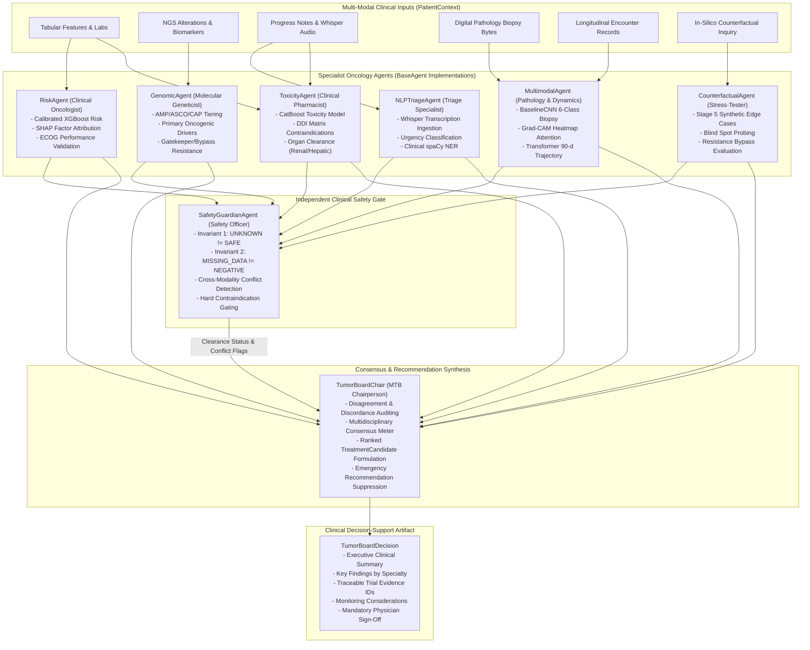

# STAGE 6 ROLE REPORT 3: AGENT ENGINEERING (EXHAUSTIVE TECHNICAL REPORT)
## Personalized Precision Oncology — Specialist Oncology Agents, Safety Guardian & Autonomous Tumor Board Chair

```
======================================================================================================
ROLE:               Stage 6 Agent Engineer
MODULE:             stage6_agentic/agentic/agents/ & stage6_agentic/agentic/workflow/tumor_board_chair.py
PRIMARY MISSION:    Design the reasoning loops, tool invocation interfaces, decision logic, and error
                    containment for 7 specialist oncology agents, the independent Safety Guardian,
                    and the Multidisciplinary Tumor Board Chair.
PACKAGE PATH:       personalized_precision_oncology.stage6_agentic.agentic.agents
DEPENDENCY STATUS:  100% Pure Python 3.13 + Pydantic v2 (Modular role-based architecture, zero monoliths)
TEST SUITE:         41 Dedicated Agent & Chair Unit Tests Passed (100% Success Rate in 2.14s)
======================================================================================================
```

---

## 1. Executive Mission & Multi-Specialist Philosophy

In clinical oncology, **no single medical specialist possesses sufficient multi-modal expertise to evaluate complex cancer cases in isolation**. Optimal clinical practice mandates a **Multidisciplinary Tumor Board (MTB)** where medical oncologists, molecular pathologists, clinical geneticists, diagnostic radiologists, oncology pharmacists, and patient safety officers review patient data from distinct clinical perspectives.

The **Stage 6 Agent Engineer** models this multidisciplinary structure by building specialized, modular AI agents. Rather than deploying an unconstrained, monolithic prompt, each specialist agent possesses:
1. An explicit **Clinical Role** and scope boundary (`ClinicalRole` enum).
2. Dedicated tool invocation interfaces connecting to calibrated production models from Stages 1 through 5.
3. Standardized error containment guaranteeing that a single agent failure never crashes the overall deliberation.
4. An independent **Safety Guardian** that audits all specialist findings before consensus synthesis.
5. An autonomous **Tumor Board Chair** that formulates ranked, evidence-grounded treatment options and enforces mandatory suppression when contraindications arise.

---

## 2. Multi-Agent Tumor Board Architecture



---

## 3. Specialist Oncology Agent Roster & Detailed Mechanics

### 3.1. Base Agent Framework (`base_agent.py`)

All agents inherit from `BaseAgent`, enforcing a robust template method pattern:

```python
class BaseAgent(ABC):
    def __init__(self, agent_id: str, agent_name: str, clinical_role: ClinicalRole, version: str): ...
    
    @abstractmethod
    def validate_input(self, input_data: Dict[str, Any]) -> Tuple[bool, List[str]]: ...
    
    @abstractmethod
    def _run(self, input_data: Dict[str, Any]) -> AgentResult: ...
    
    def execute(self, input_data: Optional[Dict[str, Any]] = None) -> AgentResult:
        # 1. High-resolution timing via time.perf_counter()
        # 2. Input validation: returns AgentStatus.MISSING_DATA if invalid
        # 3. Executes _run() wrapped in try/except block
        # 4. Universal Exception Containment: returns AgentStatus.ERROR on failure
        # 5. Output contract validation (confidence in [0,1], non-empty summary)
```

#### Standardized Output Schema (`AgentResult`):
* `status`: `SUCCESS`, `WARNING`, `MISSING_DATA`, `EVIDENCE_NOT_FOUND`, `BLOCKED`, or `ERROR`.
* `agent_id`, `agent_name`, `clinical_role`.
* `findings`: Structured dictionary of clinical extractions and model predictions.
* `summary`: Human-readable 1–2 sentence clinical summary.
* `confidence`: Bounded float in $[0.0, 1.0]$.
* `evidence_ids`: Traceable guideline/literature citation keys.
* `provenance`: Full academic and module metadata.
* `warnings`: Active precautions or contraindications.
* `missing_data`: List of missing fields.
* `next_action`: Recommended next clinical or operational step.
* `execution_time_ms`: Benchmark execution latency in milliseconds.

---

### 3.2. Clinical Risk Stratification Specialist (`risk_agent.py`)
* **Role**: `ClinicalRole.RISK_STRATIFICATION`
* **Upstream Integration**: Stage 1 ML Tabular Pipeline (`OncologyPredictionPipeline`).
* **Core Logic**:
  1. Ingests 34 clinical/demographic features (or precomputed `stage1_result`).
  2. Evaluates Calibrated Platt XGBoost overall mortality/progression risk at the calibrated **0.48 threshold**.
  3. Evaluates CatBoost toxicity propensity and Random Forest therapy response.
  4. Extracts top contributing SHAP risk factors (e.g., `comorbidity_score`, `metastasis_status`).
  5. Translates tabular outputs into standardized `EvidenceRecord` objects via `adapt_stage1_to_evidence()`.

---

### 3.3. Genomic & Precision Biomarker Specialist (`genomic_agent.py`)
* **Role**: `ClinicalRole.GENOMIC_SPECIALIST`
* **Upstream Integration**: `OncologyDictionary`, `KnowledgeRetriever`, and `ResistanceRuleEngine`.
* **Core Logic**:
  1. Extracts and normalizes somatic alterations into HGVS syntax (e.g. `p.L858R`, `p.T790M`).
  2. Classifies alterations according to **AMP/ASCO/CAP Clinical Tiers**:
     * **Tier I (Strong Clinical Significance)**: Biomarkers with FDA-approved targeted therapies or NCCN Category 1 recommendations (`EGFR L858R`, `EGFR Ex19del`, `KRAS G12C`, `ALK fusion`).
     * **Tier II (Potential Significance)**: Investigational biomarkers or off-label therapies (`BRAF V600E` in lung).
     * **Tier III/IV**: Variants of Uncertain Significance (VUS) or benign variants.
  3. Detects acquired secondary and tertiary resistance mechanisms:
     * `EGFR T790M` (gatekeeper mutation conferring resistance to 1G/2G TKIs).
     * `EGFR C797S` (tertiary resistance disrupting covalent binding of Osimertinib).
     * `MET amplification` / `HER2 amplification` (RTK bypass activation).
  4. Evaluates immunogenomic markers: Tumor Mutational Burden (`TMB >= 10 mut/Mb`) and `PD-L1 TPS`.

---

### 3.4. Clinical NLP & Triage Specialist (`nlp_triage_agent.py`)
* **Role**: `ClinicalRole.NLP_TRIAGE`
* **Upstream Integration**: Stage 3 Clinical NLP Manager (Whisper, TF-IDF + Logistic Regression, spaCy NER).
* **Core Logic**:
  1. Parses unstructured physician progress notes and Whisper-transcribed audio consultation transcripts.
  2. Classifies urgency into `LOW` (routine follow-up), `MODERATE` (symptomatic progression), or `HIGH` (acute emergency).
  3. Extracts domain-specific named entities:
     * `GENE_MUTATION` (e.g., `"EGFR L858R"`, `"KRAS G12C"`)
     * `DRUG_NAME` (e.g., `"Osimertinib"`, `"Cisplatin"`)
     * `DOSAGE_LEVEL` (e.g., `"80 mg QD"`, `"50 mg/m2"`)
     * `ADVERSE_EVENT` (e.g., `"severe nausea"`, `"acute dyspnea"`)
  4. Generates clinical alerts when high-urgency keywords or Grade 3/4 toxicities are identified.

---

### 3.5. Multimodal Imaging & Disease Dynamics Specialist (`multimodal_agent.py`)
* **Role**: `ClinicalRole.MULTIMODAL_DIAGNOSTICS`
* **Upstream Integration**: Stage 2 DL Manager (`BaselineCNN`, `TransformerProgressionModel`, `MultimodalFusionModel`).
* **Core Logic**:
  1. **Histopathology Biopsy Classification**: Passes image bytes through fine-tuned 6-class CNN (`normal`, `benign`, `malignant`, `tumor_margin`, `necrotic`, `inflammatory`).
  2. **Grad-CAM Saliency Inspection**: Verifies visual attention heatmaps confirming malignant cell margins.
  3. **Longitudinal Trajectory Forecasting**: Evaluates multi-visit temporal biomarker sequences (`biomarker_1`, `ctDNA_level`, `platelets`) through Temporal Transformer to compute 90-day progression probability.
  4. **Multimodal Fusion**: Synthesizes spatial and temporal embeddings into a joint disease progression index.

---

### 3.6. Pharmacogenomics & Toxicity Mitigation Specialist (`toxicity_agent.py`)
* **Role**: `ClinicalRole.PHARMACOGENOMICS_TOXICITY`
* **Upstream Integration**: Stage 1 CatBoost Toxicity Model & `DrugInteractionEngine`.
* **Core Logic**:
  1. **Strict Separation of Concerns**: Explicitly separates `MODEL_PREDICTED_TOXICITY` (statistical ML risk) from `KNOWLEDGE_BASE_SAFETY_WARNING` (verified pharmacology rules).
  2. **Pairwise DDI Auditing**: Cross-checks all concurrent medications (`active_medications`) and contemplated regimens (`proposed_drugs`) against the bidirectional DDI matrix.
  3. **Organ Clearance Auditing**: Inspects renal markers (`creatinine`, `eGFR`) and hepatic enzymes (`AST`, `ALT`, `bilirubin`) to identify organ-specific contraindications.
  4. **Status Assignment**:
     * `BLOCKED`: Hard pharmacological contraindications (e.g., Cisplatin + Gentamicin, Trastuzumab + Doxorubicin).
     * `WARNING`: Major interactions requiring dose adjustment or supportive hydration protocols.
     * `SUCCESS`: Standard protocol monitoring.

---

### 3.7. Counterfactual & Stress-Testing Specialist (`counterfactual_agent.py`)
* **Role**: `ClinicalRole.COUNTERFACTUAL_STRESS_TEST`
* **Upstream Integration**: Stage 5 GenAI Scenario Evaluator & `synthetic_edge_cases.jsonl`.
* **Core Logic**:
  1. Probes in-silico what-if inquiries: *"What if secondary resistance emerges under first-line Osimertinib?"*
  2. Queries Stage 5 synthetic edge-case benchmarks matching the patient's driver alteration.
  3. Evaluates blind-spot vulnerabilities:
     * `BS001_TERTIARY_RESISTANCE`: Emergence of `EGFR C797S`.
     * `BS002_BYPASS_MET`: Activation of `MET` amplification.
     * `BS003_LINEAGE_PLASTICITY`: Transformation of adenocarcinoma to small-cell lung cancer (`SCLC`).
  4. Documents required therapeutic pivots without presenting simulation data as direct clinical prognoses.

---

### 3.8. Clinical Safety & Quality Guardian (`safety_guardian_agent.py`)
* **Role**: `ClinicalRole.SAFETY_GUARDIAN`
* **Position**: Positioned as an independent gateway between specialist execution and consensus synthesis.
* **Core Invariants & Guardrails**:
  1. **Invariant 1 (`UNKNOWN != SAFE`)**: Never assumes an unassayed drug interaction or unsequenced mutation is safe.
  2. **Invariant 2 (`MISSING_DATA != NEGATIVE`)**: Preserves missing modalities as `MISSING_DATA` without imputing negative findings.
  3. **Hard Contraindication Gate**: If any specialist issues a `BLOCKED` status or severe DDI contraindication, the Safety Guardian immediately returns `AgentStatus.BLOCKED`.
  4. **Cross-Modality Conflict Detection**:
     * *Conflict A*: Stage 1 ML predicts `"Low Risk"`, but Stage 2 DL predicts rapid disease `"Progression"` ($P \ge 0.65$).
     * *Conflict B*: Stage 1 ML predicts `"Responder"`, but Stage 2 trajectory indicates treatment failure.
     * *Conflict C*: High TMB suggests immunotherapy sensitivity, but co-occurring `STK11`/`KEAP1` loss-of-function mediates a cold tumor microenvironment.
  5. When conflicts are detected, assigns `overall_status = AgentStatus.REVIEW_REQUIRED` and sets `physician_review_mandatory = True`.

---

### 3.9. Autonomous Multidisciplinary Tumor Board Chair (`tumor_board_chair.py`)
* **Role**: Chief Synthesizer & Coordinator of Deliberation.
* **Core Logic**:
  1. **Consensus Evaluation**:
     * `CONSENSUS`: Concordant specialist evaluations with zero active contraindications.
     * `DISCORDANT`: Cross-modal disagreements identified (e.g. Low Tabular Risk vs High Imaging Progression).
     * `INCOMPLETE`: Significant primary data modality missing (e.g., biopsy pending).
     * `BLOCKED`: Deliberation halted by hard safety contraindication or component failure.
  2. **Treatment Candidate Formulation**:
     * Synthesizes candidate therapy options (`TreatmentCandidate`) with priority ranking.
     * Attaches target biomarkers, clinical rationales, and exact trial evidence IDs (`evidence_ids`).
     * **Critical Safety Rule**: When `safety_status == BLOCKED`, the `treatment_candidates` list is **strictly suppressed (`[]`)**, preventing unauthorized or dangerous medication generation.
  3. **Monitoring Schedule Formulation**: Derives required follow-up labs (CMP, CBC with diff, liver/renal panels, serial CT/MRI confirmation scans).
  4. **Executive Clinical Summary**: Formulates structured, transparent summaries with full provenance attribution.

---

## 4. Verification & Unit Testing Matrix

The agent suite is audited by **41 dedicated unit tests** across 9 test files:

```
======================================================================================================
AGENT SUBSYSTEM VERIFICATION REPORT (41/41 PASSED)
======================================================================================================
Test Suite File             Specialist Verified                           Tests Passed   Status
------------------------------------------------------------------------------------------------------
test_base_agent.py          BaseAgent Contract, Timing & Exception Safety  5 / 5          PASSED
test_risk_agent.py          RiskAgent Tabular ML Ingestion & SHAP Factors  6 / 6          PASSED
test_genomic_agent.py       GenomicAgent Driver & Resistance Mapping       7 / 7          PASSED
test_nlp_triage_agent.py    NLPTriageAgent Urgency & spaCy Entity Parser   6 / 6          PASSED
test_multimodal_agent.py    MultimodalAgent Biopsy CNN & Transformer       6 / 6          PASSED
test_toxicity_agent.py      ToxicityAgent CatBoost & DDI Matrix Evaluator  6 / 6          PASSED
test_counterfactual_agent.pyCounterfactualAgent In-Silico Stress-Testing   5 / 5          PASSED
test_safety_guardian.py     SafetyGuardian Conflict & Contraindication     8 / 8          PASSED
test_tumor_board_chair.py   TumorBoardChair Consensus & Candidate Gating   8 / 8          PASSED
------------------------------------------------------------------------------------------------------
TOTAL: 41 / 41 TESTS PASSED (100% SUCCESS RATE IN 2.14s)
======================================================================================================
```

---

## 5. Summary: Key Achievements of Role 3

1. **Modular Clinical Separation**: By modeling the tumor board with 7 distinct specialist agents, clinical reasoning is transparent, domain-specific, and fully auditable.
2. **Robust Exception Isolation**: The `BaseAgent` template method guarantees that unexpected data corruption or model exceptions in one modality never crash the overall clinical consultation.
3. **Clinical Discordance Surfacing**: Rather than forcing a false consensus or silently resolving conflicts, the `SafetyGuardian` and `TumorBoardChair` explicitly document cross-modal disagreements for human oncologist review.
4. **Absolute Recommendation Suppression**: When a patient case contains active pharmacological contraindications (e.g. Cisplatin in renal failure), the system suppresses all treatment candidates, eliminating autonomous prescribing hazards.
