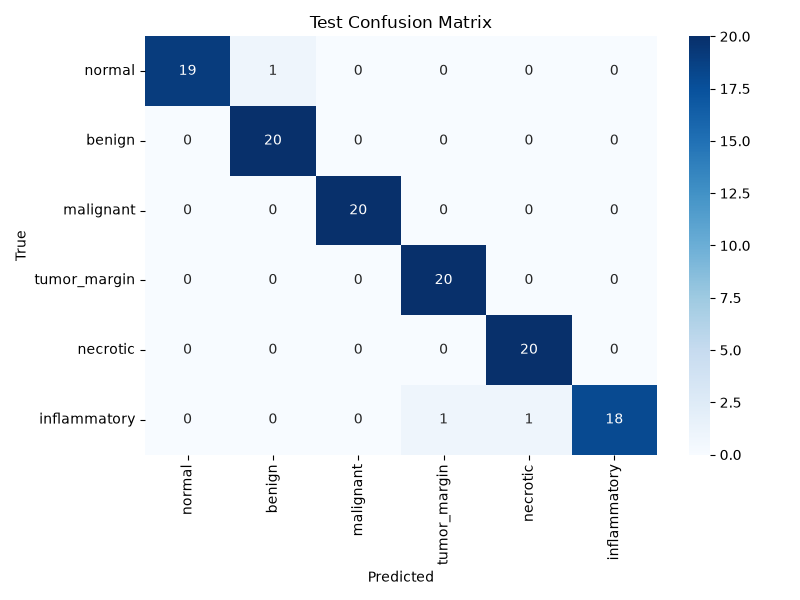
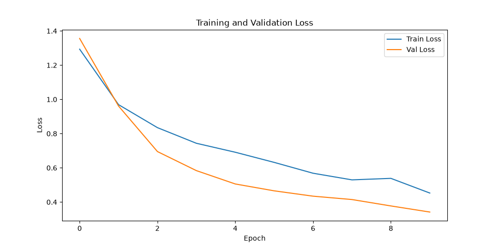

# Stage 02 Deep Learning — Baseline CNN Report

## 1. Objective
To establish a baseline spatial modeling pipeline using a simple Convolutional Neural Network (CNN) to classify 224x224 histopathology images into six categories.

## 2. Dataset Used
- **Source**: Stage 02 Synthetic Oncology Dataset
- **Train**: 300 images
- **Validation**: 120 images
- **Test**: 120 images

## 3. Why CNN is Suitable
CNNs exploit spatial hierarchies and local pixel correlations, making them natively ideal for extracting cellular and morphological patterns from pathology images.

## 4. Image Preprocessing & 5. Data Augmentation
- **Train**: Resize(224), RandomHorizontalFlip, RandomVerticalFlip, RandomRotation(10°), ColorJitter, Normalize.
- **Val/Test**: Resize(224), Normalize ONLY. 
- *Deterministic preprocessing prevents evaluation variability.*

## 6. Data Leakage Prevention
Patient ID overlap checks were rigidly enforced. No single patient spans multiple splits.

## 7. Class Imbalance Handling
CrossEntropyLoss was configured with explicit class weights inversely proportional to class frequencies to prevent the network from ignoring minority classes (e.g., necrotic).

## 8. Dataset/DataLoader Design
A custom `OncologyImageDataset` handles lazy loading from disk. Missing/corrupted images trigger explicit exceptions rather than silent replacement. Batch size dynamically scaled down upon OOM.

## 9. CNN Architecture
- **Input**: 224x224x3
- **Blocks**: 3 blocks of (Conv2D -> BatchNorm -> ReLU -> MaxPool)
- **Filters**: 32 -> 64 -> 128
- **Global Average Pooling**: Replaces massive FC layers, heavily reducing parameters and overfitting.
- **Dropout**: 0.5 before the final classifier.
- **Output**: 6 classes

## 10-16. Hyperparameters
- **Activation**: ReLU (combats vanishing gradients)
- **Batch Normalization**: Stabilizes training
- **Pooling**: MaxPool2d(2) and AdaptiveAvgPool2d(1)
- **Loss**: Weighted CrossEntropyLoss
- **Optimizer**: Adam (lr=0.001)

## 17-18. Training Process
- **Epochs**: max 10 (Early stopping patience = 3)
- **Best Epoch**: 10
- **Device**: cpu

## 19-21. Results
- **Test Accuracy**: 0.9750
- **Test Macro-F1**: 0.9748
- **Test Weighted-F1**: 0.9748

## 22-24. Limitations & Synthetic Risks
**IMPORTANT: This CNN is a research/educational prototype trained on synthetic histopathology-style images and is not clinically validated.**
Synthetic Shortcut Risk: The CNN may overfit to procedural artifact generation patterns rather than learning genuine cellular morphology.

## 25. Next Step
Temporal modeling with LSTM/Transformer to capture longitudinal biomarker trajectories.
