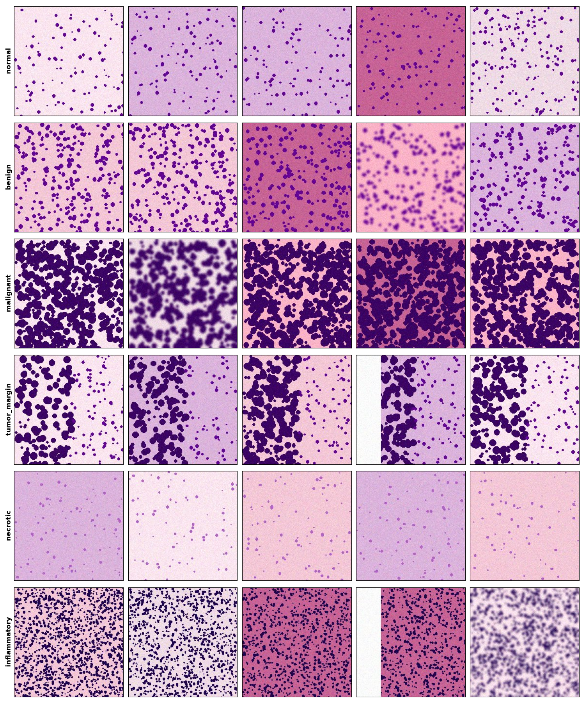
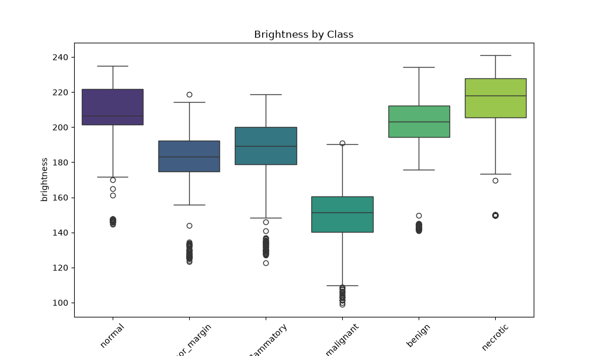
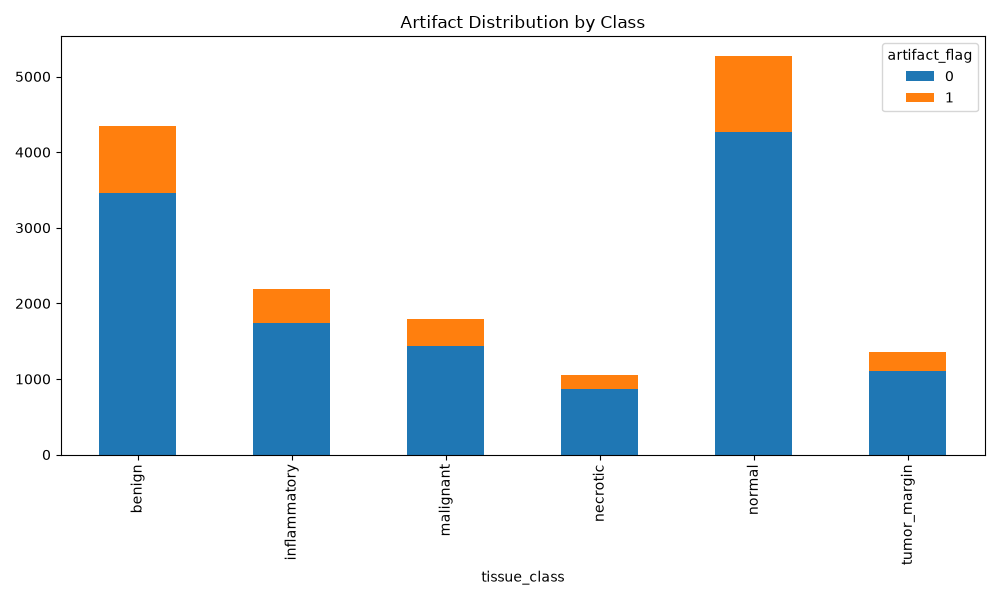
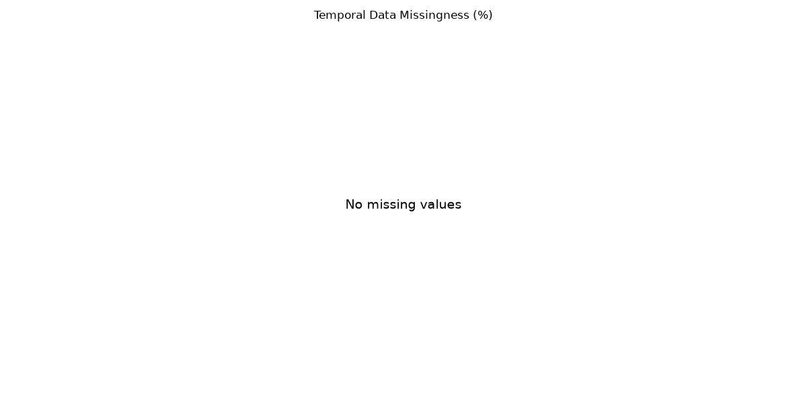
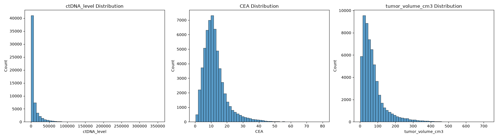
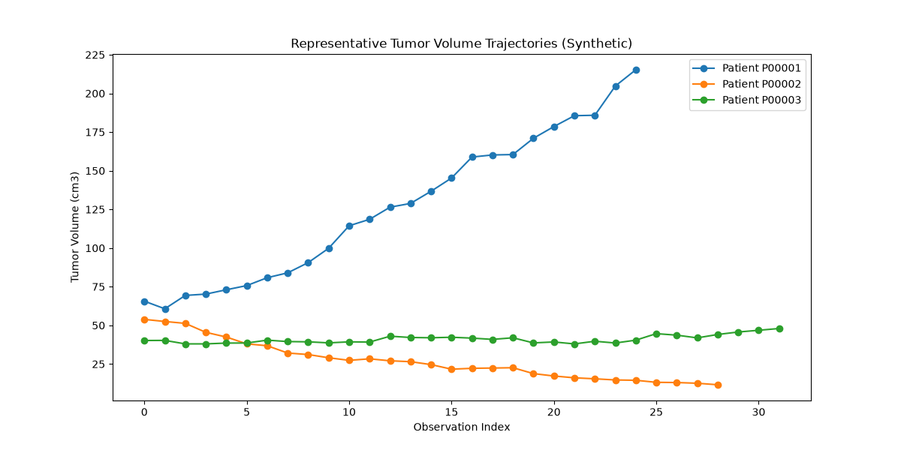
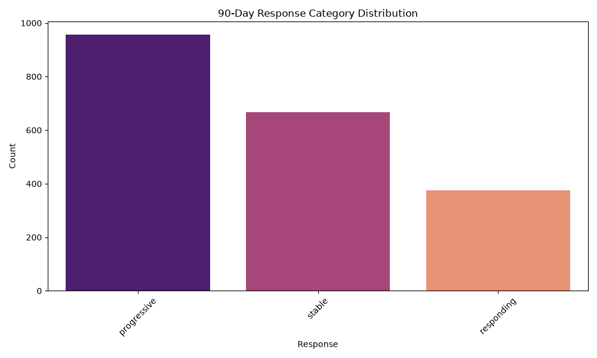
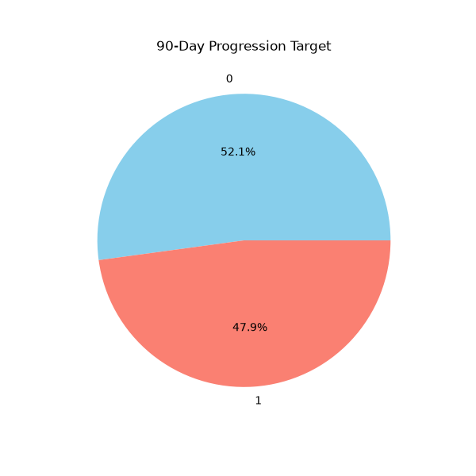

# Stage 02 Deep Learning — EDA Report

## 1. Objective
Perform comprehensive Exploratory Data Analysis (EDA) on the Stage 02 synthetic oncology dataset to validate data integrity, characterize spatial/temporal distributions, and inform deep learning model architectures (CNN & Sequence Models).

## 2. Dataset Overview
- **Total Patients**: 2000
- **Train Split**: 1400
- **Validation Split**: 300
- **Test Split**: 300
- **Spatial Records**: 16000 (across 4755 slides and 16000 tiles)
- **Temporal Observations**: 58979

## 3. Image EDA

### 3.1 Image Statistics
- Sample mean intensity: 175.61
- Sample brightness: 187.10
- Sample contrast (std dev): 53.56

### 3.2 Class Distribution
The dataset contains 6 primary histopathology classes:
- **normal**: 5268 images (32.9%)
- **benign**: 4351 images (27.2%)
- **inflammatory**: 2186 images (13.7%)
- **malignant**: 1790 images (11.2%)
- **tumor_margin**: 1352 images (8.5%)
- **necrotic**: 1053 images (6.6%)

### 3.3 Train/Validation/Test Distribution
Split distribution ensures no data leakage. 
Patient Leakage Count: **0**

### 3.4 Sample Images

### 3.5 Pixel Statistics

### 3.6 Artifact Analysis

### 3.7 Stain and Magnification
Various stains (H&E, IHC) and magnifications (20x, 40x) are represented.

### 3.8 Pathology Metadata
Cellular atypia, inflammation, and necrosis scores correspond roughly to the designated image classes, providing multi-label learning opportunities.

## 4. Temporal EDA

### 4.1 Sequence Statistics
- Min length: 25
- Max length: 34
- Mean length: 29.5
- Median length: 29.0

### 4.2 Missing Values

### 4.3 Biomarker Distributions

### 4.4 Longitudinal Trends

### 4.5 Response Categories

### 4.6 90-Day Targets

## 5. Data Quality
- Invalid tumor volumes (< 0): 0

## 6. Leakage Analysis
No temporal or spatial patient leakage detected across splits.

## 7. Class Imbalance
The dataset exhibits moderate class imbalance, with `normal` and `benign` dominating the minority classes like `necrotic` and `tumor_margin`.

## 8. Synthetic Dataset Limitations
**IMPORTANT**: The pathology images in this dataset are procedurally generated synthetic pathology-style images and are not clinically validated histopathology images. 
A CNN trained on this dataset may learn synthetic generator patterns (e.g., consistent repetitive textures or artificial backgrounds) instead of genuine pathological morphology. Suspicious uniformities in stain intensities across identical classes strongly indicate synthetic shortcuts.

## 9. Recommendations for DL Modeling
**For CNN**:
- **Image normalization**: Standard ImageNet normalization.
- **Augmentation**: Heavy spatial augmentation (rotations, flips, color jitter) is mandatory to disrupt synthetic shortcuts.
- **Class weights or weighted sampling**: Apply weighted sampling in the DataLoader to combat the imbalance between `normal` and `necrotic`.
- **Metrics**: Optimize for macro F1 and per-class recall rather than standard accuracy.

**For Sequence Model**:
- **Feature normalization**: Z-score normalization for biomarkers.
- **Sequence padding/masking**: Use dynamic padding up to 34 timesteps with masking.
- **Sequence length strategy**: Use packed sequences or truncated BPTT.
- **Missing-value handling**: Impute missing biomarker data using forward-filling combined with learned embedding masks.

## 10. Conclusion
The dataset is structurally sound and ready for modeling, provided strict countermeasures are deployed to handle class imbalances and synthetic artifact shortcuts.
