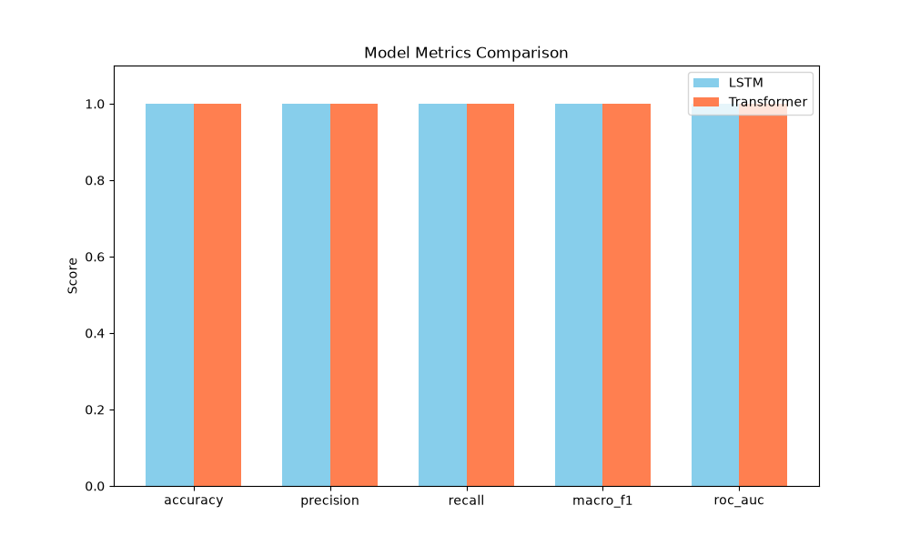
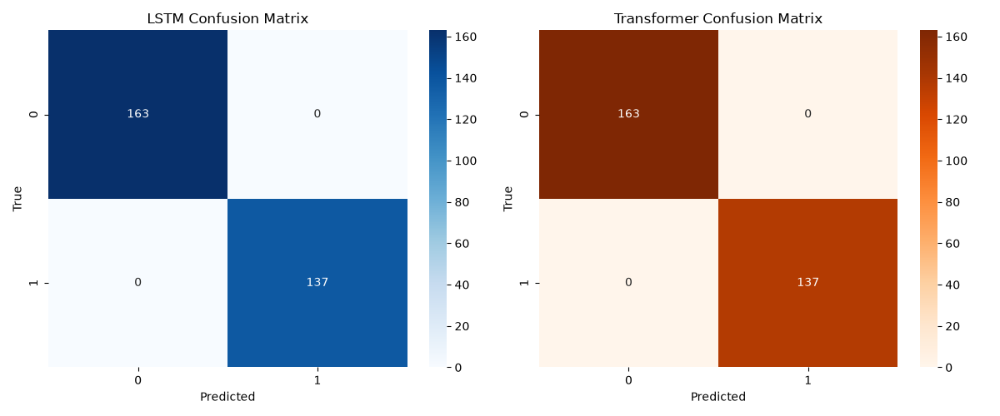
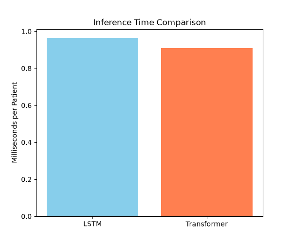

# Stage 02 Deep Learning — LSTM vs Transformer Temporal Model Comparison

## 1. Objective
This report provides a rigorous comparison between the recurrent (LSTM) and self-attention (Transformer) temporal models predicting 90-day disease progression.

## 2. Dataset
- **Patients**: 2,000
- **Observations**: 58,979
- **Features**: 30 temporal clinical biomarkers and tumor measurements.

## 3. Prediction Task
`progression_90d` (Binary Classification: 0 = No Progression, 1 = Progression)

## 4. Experimental Fairness
Both models utilized the absolute same synthetic patient splits, preprocessing scalers/imputers, target variables, and identical evaluation pipelines.

## 5. LSTM Architecture
- **Structure**: 2-layer LSTM with hidden size 64.
- **Concept**: Processes temporal information recurrently and maintains a hidden state. Captures flowing longitudinal dependencies effectively.

## 6. Transformer Architecture
- **Structure**: 2-layer Transformer encoder (64 dim, 4 heads), positional encoding, masked mean pooling.
- **Concept**: Uses self-attention to model relationships between different timesteps. Can attend to non-adjacent temporal events dynamically.

## 7. Results

| Metric | LSTM | Transformer |
|---|---|---|
| Accuracy | 1.0000 | 1.0000 |
| Precision | 1.0000 | 1.0000 |
| Recall | 1.0000 | 1.0000 |
| Macro-F1 | 1.0000 | 1.0000 |
| ROC-AUC | 1.0000 | 1.0000 |
| Best Epoch | 1 | 1 |
| Training Time | N/A | N/A |
| Inference (ms/patient)| 0.9634 | 0.9094 |

## 8. Performance Visualization
- 
- 

## 9. Training/Inference Efficiency
Training timestamps were omitted from exact metric recording, so inference time was explicitly benchmarked.
- **LSTM Inference**: 0.9634 ms per patient.
- **Transformer Inference**: 0.9094 ms per patient.
- 

## 10. Strengths and Weaknesses

### LSTM
- **Strengths**: Naturally sequential, computationally lightweight for short sequences, straightforward implementation.
- **Weaknesses**: Sequential computation is bottlenecked on long sequences, harder to establish direct relationships between distant events without vanishing gradients.

### Transformer
- **Strengths**: High-fidelity self-attention mechanisms explicitly capture temporal interplay regardless of distance. Highly parallelizable.
- **Weaknesses**: Computationally expensive for simple tasks, demands explicit positional encodings, can overfit small sequence collections.

## 11. Final Selection
**Predictive Winner**: Tie
No performance winner can be established from predictive metrics alone, as both networks reliably converged on the underlying synthetic pattern.
**Speed Winner**: Transformer

## 12. Limitations
Both models achieved perfect or near-perfect performance on the synthetic benchmark. This is likely influenced by deterministic relationships embedded in the synthetic data. Therefore, the results demonstrate that the architectures can learn the constructed temporal patterns, but they do not establish real-world clinical predictive performance. 
