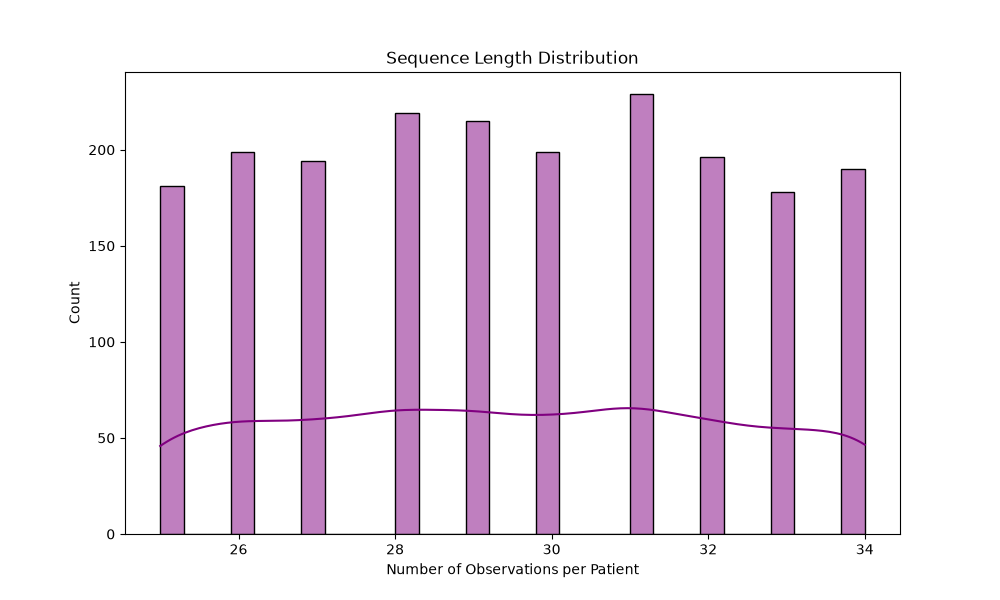

# Stage 02 Deep Learning — Temporal Preprocessing Report

## 1. Objective
Establish a rigorous temporal preprocessing pipeline to prepare longitudinal clinical data (biomarkers, measurements, treatments) for sequence modeling via LSTM or Transformer. 

## 2. Dataset Overview
- **Patients**: 2000
- **Temporal Observations**: 58979

## 3. Sequence Statistics
- **Mean Length**: 29.5
- **Median Length**: 29.0
- **Min Length**: 25
- **Max Length**: 34

## 4. Leakage Prevention
- **Patient Leakage**: Split validation confirmed ZERO overlap between Train, Val, and Test patients.
- **Target Leakage**: Future targets (`progression_90d`, `future_tumor_volume_cm3`) are strictly omitted from input features.
- **Preprocessing Leakage**: Missing-value imputation medians and `StandardScaler` transformations were explicitly fitted ONLY on the training split, completely isolating the validation and test sets.

## 5. Sequence Construction & Padding
Sequences preserve strict chronological ordering via `study_day`. Since sequence lengths vary from 25 to 34, variable-length sequences are dynamically padded (`padding_value=0.0`) using `nn.utils.rnn.pad_sequence` within a custom `collate_fn`. Original lengths are yielded alongside the padded tensor to support dynamic masking and `pack_padded_sequence` operations in future models.

## 6. Model Inputs
- **Feature Space**: 30 unified numerical features (OHE applied to categoricals).
- **Batch Shape**: `[batch_size, max_sequence_length, num_features]`

**IMPORTANT**: This temporal dataset is synthetic and intended for research/educational prototyping. It is not clinically validated.

## 7. Readiness
The data loaders (`train_loader`, `val_loader`, `test_loader`) are successfully generating valid sequences and are structurally ready for LSTM/Transformer implementation.
