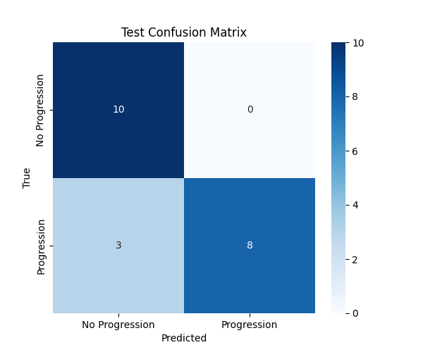

# Stage 02 Deep Learning — Transformer Temporal Modeling Report

## 1. Purpose
To establish a Transformer-based sequence classification model to predict 90-day disease progression. This forms a robust baseline intended for direct benchmarking against the previously trained LSTM model on the exact same dataset.

## 2. LSTM vs Transformer
- **LSTM**: Processes the sequence recurrently and maintains hidden state. It is excellent for continuous temporal flow but can suffer over very long sequences.
- **Transformer**: Uses self-attention to model relationships between different timesteps simultaneously. It attends to critical historical events irrespective of their distance in the sequence but fundamentally lacks built-in sequential order.

## 3. Input
The model receives 30 normalized temporal features spanning tumor volumes, multi-gene markers (ctDNA, CEA, LDH), and treatment status encodings. These are identical to the LSTM inputs.

## 4. Sequence representation
Observations are grouped into patient timelines chronologically (`study_day`). They vary in length and are zero-padded batch-wise up to the longest sequence in that specific batch.

## 5. Positional encoding
Because attention mechanisms process the entire sequence symmetrically and non-sequentially, we inject Sinusoidal Positional Encoding. This ensures the model explicitly understands that Time 1 occurred before Time 34.

## 6. Self-attention
The `nhead=4` multi-head self-attention module allows the model to determine which timesteps (e.g., a sudden ctDNA spike at day 12) are most important in relation to others (e.g., an earlier treatment modification at day 5) when predicting future progression.

## 7. Padding mask
Because patients have varying sequence lengths, padding creates artificial "empty" timesteps. We explicitly supply a `src_key_padding_mask` to the Transformer encoder. This unequivocally forces the self-attention weights to zero for padded positions, preventing them from corrupting the valid temporal relationships.

## 8. Architecture
- **Features**: 30
- **Linear projection**: 30 → 64
- **Positional encoding**: Sinusoidal
- **Encoder**: 2 layers, 4 heads, 128 feedforward dim, batch_first=True
- **Aggregation**: Masked mean pooling
- **Dropout**: 0.3
- **Linear classifier**: 64 → 2 classes (Progression 90d)

## 9. Training Configuration
- Optimizer: Adam (lr=0.001)
- Loss: Weighted CrossEntropyLoss
- Batch size: 32
- Epochs: 10 (Patience: 3)
- Best Epoch: 2

## 10. Results (Test Set)
- **Accuracy**: 0.8571
- **Precision**: 1.0000
- **Recall**: 0.7273
- **Macro-F1**: 0.8558
- **ROC-AUC**: 0.9273

## 11. Limitations
**This Transformer is a research/educational prototype trained on synthetic clinical data.** The dataset is synthetic and educational, not representing true human biological chaos. Performance does not represent clinical validation. No real WSI/CT/MRI data is being used, and this model cannot diagnose or predict progression in real patients.
