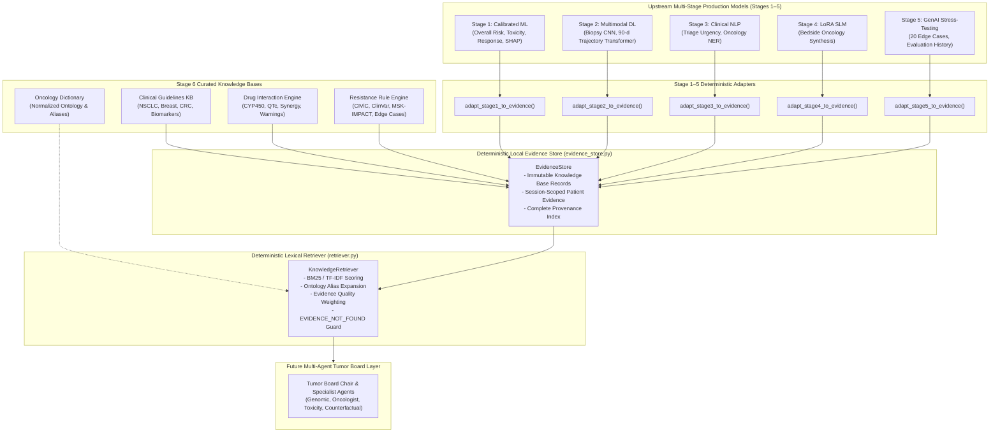

# Stage 6: Agentic AI — Knowledge & Evidence Layer

**Package**: `personalized_precision_oncology.stage6_agentic.knowledge`  
**Status**: Foundational Deterministic Knowledge & Traceability Architecture  
**Disclaimers**:  
> **"Academic Clinical Decision-Support Knowledge Base"**  
> **"Not a clinical prescribing system."**

---

## 1. Purpose & Clinical Scope

In oncology precision medicine, autonomous multi-agent reasoning must be grounded in immutable, verifiable clinical evidence. Generic LLMs suffer from stochasticity, lack of temporal grounding, and clinical hallucination—an unacceptable hazard in oncological decision-making.

The **Stage 6 Knowledge and Evidence Layer** provides:
1. **Deterministic Clinical Truth Grounding**: Standardized, evidence-graded guidelines (NCCN Category 1/2A, ASCO, FDA CDx approvals) and pharmacokinetic drug-drug interaction rules.
2. **Multi-Stage Observational Grounding**: Read-only adapters converting validated machine learning predictions (Stage 1 ML, Stage 2 DL, Stage 3 NLP, Stage 4 SLM, and Stage 5 GenAI stress-tests) into structured, provenance-attributed evidence records.
3. **Lexical Retrieval Engine**: Fast, offline BM25/TF-IDF scoring augmented with domain ontology synonym expansion—requiring zero external cloud APIs or GPU inference.
4. **Hallucination Prevention**: Explicit safety guardrails that return `EVIDENCE_NOT_FOUND` whenever clinical evidence or drug interaction rules are unverified, preventing fabricated citations or contraindications.

---

## 2. Architecture Overview



---

## 3. Evidence Schema (`schemas.py`)

Every piece of clinical context in Stage 6 is modeled as an `EvidenceRecord` conforming to strict Pydantic v2 validation:

```python
class EvidenceRecord(BaseModel):
    evidence_id: str                   # Deterministic identifier (e.g. 'KB-GUIDE-NSCLC-EGFR-1L')
    source_stage: EvidenceStage        # STAGE1 through STAGE5 or KNOWLEDGE_BASE_EVIDENCE
    source_module: str                 # Exact Python module/class generating the record
    category: str                      # genomic, toxicity, guideline, resistance, etc.
    topic: str                         # Concise clinical description
    matched_terms: List[str]           # Keywords and synonyms
    evidence_text: str                 # Verbatim evidence or prediction statement
    evidence_level: EvidenceLevel      # Level A, Level B, Level C, Level D, Expert Consensus, Model Inference
    safety_note: Optional[str]         # Precaution, black-box warning, or action threshold
    provenance: ProvenanceRecord       # Full academic citation, study, DOI/PMID, and license
    limitations: Optional[str]         # Boundary conditions or uncertainty notes
    metadata: Dict[str, Any]           # Structured numerical/categorical parameters
```

### Evidence Levels
- **Level A**: High-quality randomized controlled trials (RCTs), FDA CDx approvals, NCCN Category 1 recommendations (e.g., FLAURA, KEYNOTE-024).
- **Level B**: Well-designed prospective cohorts, clinical trial sub-analyses, NCCN Category 2A recommendations.
- **Level C**: Retrospective registry series, exploratory basket cohorts, single case reports.
- **Level D**: Preclinical in vitro/in vivo mechanistic studies.
- **Expert Consensus**: International consensus guidelines (e.g. RECIST 1.1, CTCAE v5.0).
- **Model Inference**: Direct outputs from calibrated Stage 1–5 models.

---

## 4. Deterministic Lexical Retrieval Process

The `KnowledgeRetriever` eliminates black-box vector search and LLM hallucinations by executing a fully deterministic lexical pipeline:

1. **Ontology Query Expansion**: Queries are processed through `OncologyDictionary`. For example, `"EGFR L858R NSCLC"` expands into `["egfr", "l858r", "p.l858r", "exon 21", "non-small cell lung cancer", "nsclc", "luad"]`.
2. **Corpus BM25 Scoring**: Inverse Document Frequency (IDF) is calculated across the evidence corpus, penalizing ubiquitously common words while amplifying specific genomic/pharmacological terms.
3. **Field Weighting Boosts**:
   - Matches in `topic` (document title) receive a **3.0x** weight boost.
   - Matches in `matched_terms` receive a **2.0x** boost.
   - Exact query phrase matches receive a **5.0x** boost.
4. **Evidence Quality Multipliers**: Level A evidence is weighted at **1.25x**, Level B at **1.15x**, and Model Inference at **1.05x**.
5. **Deterministic Sort**: Candidates are sorted by `(-relevance_score, evidence_id)`. Identical queries against identical stores guarantee bit-for-bit identical ranked responses.
6. **Guardrail Enforcement**: If no candidate reaches `min_relevance`, the retriever returns `status="EVIDENCE_NOT_FOUND"`, preventing ungrounded speculation.

---

## 5. Provenance & Audit Trail

Every evidence record includes a `ProvenanceRecord`:
- `source_name`: Source organization, regulatory agency, or model suite.
- `source_dataset`: Underlying dataset file or public release.
- `source_module`: Exact Python function or module producing the record.
- `source_study`: Trial identifier (e.g. `KEYNOTE-024`, `FLAURA`).
- `publication`: Author and journal reference.
- `doi_or_pmid`: Digital Object Identifier or PubMed accession number.
- `license`: Data governance and usage permissions.

No citations are fabricated.

---

## 6. Safety Guardrails & Hallucination Prevention

The knowledge layer enforces four hard safety constraints:
1. **Never Invent Facts**: Unobserved biomarkers or missing mutations are represented as `None` or `"not_observed_in_reference"`.
2. **Never Invent Contraindications**: Drug pairs without documented clinical interactions return `None` from `check_interaction()`.
3. **Never Recommend Off-Label Without Trial Evidence**: Unsupported therapies are explicitly excluded.
4. **Mandatory Academic Disclaimers**: All responses carry the prominent disclaimer that this system is an academic research decision-support tool and not a clinical prescribing system.

---

## 7. Stage 1–5 Integration Interface

Stage 6 integrates with Stages 1–5 via clean adapter functions that parse pre-computed dictionaries or real-time inference outputs:

| Stage | Producer Function | Adapter Function | Extracted Evidence Topics |
| :--- | :--- | :--- | :--- |
| **Stage 1 ML** | `OncologyPredictionPipeline.predict()` | `adapt_stage1_to_evidence()` | Overall patient risk, calibrated probability, CatBoost toxicity risk, RF therapy response, SHAP factors. |
| **Stage 2 DL** | `Stage2DLManager.predict_image()` / `predict_trajectory()` | `adapt_stage2_to_evidence()` | Biopsy tissue class (malignant/benign), Grad-CAM heatmap status, 90-day progression velocity. |
| **Stage 3 NLP** | `Stage3NLPManager.predict_urgency()` / `extract_entities()` | `adapt_stage3_to_evidence()` | Clinical triage urgency (`HIGH`/`MODERATE`/`LOW`), extracted oncology entities (genes, drugs, AEs). |
| **Stage 4 SLM** | `Stage4SLMManager.generate_briefing()` | `adapt_stage4_to_evidence()` | Synthesized 1–2 sentence bedside oncology briefing, latency, synthetic data disclaimers. |
| **Stage 5 GenAI** | `ScenarioEvaluator.evaluate_scenario()` | `adapt_stage5_to_evidence()` | Synthetic stress-testing audit, realism score, stress score, blind spot identifiers. |

> [!NOTE]
> Heavy deep learning and SLM checkpoints are **never loaded during module import**. Everything is evaluated lazily or consumes standard Python dictionaries.

---

## 8. Why Pure Python & Deterministic Retrieval?

1. **Zero Dependency Rot**: Heavy agent frameworks (LangChain, CrewAI, AutoGen) frequently introduce dependency conflicts (e.g. pinned Pydantic v1 vs v2, incompatible torch/transformers versions), broken abstractions, and unneeded telemetry.
2. **Python 3.13 Compatibility**: Modern pure Python with Pydantic v2 (`2.13.4`) executes cleanly on Windows AMD64 without build tools.
3. **100% Test Reproducibility**: Unit tests execute in milliseconds without external internet access or GPU acceleration.
4. **Clinical Auditability**: Deterministic scoring ensures that every decision rendered by future specialist agents can be traced step-by-step back to exact trial publications and calibrated model checkpoints.

---

## 9. Consumption Guide for Future Specialist Agents

In subsequent development phases, specialist agents will query this layer using standard interfaces:

```python
from personalized_precision_oncology.stage6_agentic.knowledge import (
    EvidenceStore,
    KnowledgeRetriever,
    adapt_stage1_to_evidence,
    adapt_stage2_to_evidence,
    adapt_stage3_to_evidence
)

# 1. Initialize local evidence store and retriever
store = EvidenceStore(populate_knowledge_base=True)
retriever = KnowledgeRetriever(store=store)

# 2. Ingest patient-specific multi-stage inference results
patient_id = "PT-10023"
store.add_records(adapt_stage1_to_evidence(patient_id, s1_result))
store.add_records(adapt_stage2_to_evidence(patient_id, s2_result))
store.add_records(adapt_stage3_to_evidence(patient_id, s3_result))

# 3. Specialist Agents query the evidence layer
# Genomic Specialist queries targeted standards:
genomic_evidence = retriever.retrieve("EGFR L858R NSCLC", top_k=3)

# Toxicity Specialist checks drug interactions:
drug_rule = store.drug_engine.check_interaction("Osimertinib", "Rifampin")

# Counterfactual Agent checks resistance bypass:
resistance_rules = store.resistance_engine.get_resistance_rules_for_gene("EGFR")
```
